# Lohono AI — Technical Documentation

Comprehensive technical reference for the Lohono AI MCP platform. For quickstart and operational commands, see [README.md](README.md).

---

## Table of Contents

- [System Architecture](#system-architecture)
- [Services Overview](#services-overview)
- [MCP Server — Database Context Tools](#mcp-server--database-context-tools)
- [Helpdesk Server — Knowledge Base Tools](#helpdesk-server--knowledge-base-tools)
- [MCP Client — Claude Orchestration](#mcp-client--claude-orchestration)
- [Multi-MCP Server Routing](#multi-mcp-server-routing)
- [Authentication and Authorization](#authentication-and-authorization)
- [Access Control (ACL)](#access-control-acl)
- [Database Catalog System](#database-catalog-system)
- [Sales Funnel Tool](#sales-funnel-tool)
- [NLQ Resolution Pipeline](#nlq-resolution-pipeline)
- [Time Range Parsing](#time-range-parsing)
- [Chat Client](#chat-client)
- [Observability](#observability)
- [Deployment Modes](#deployment-modes)
- [SSH Tunnel for Local Development](#ssh-tunnel-for-local-development)

---

## System Architecture

The platform follows a **four-tier architecture**: Chat Client, MCP Client (orchestration), MCP Servers (tools), and data stores.

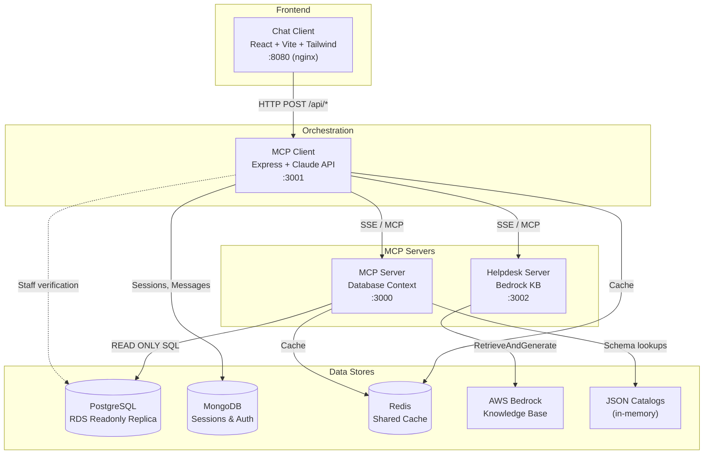

### Container Topology

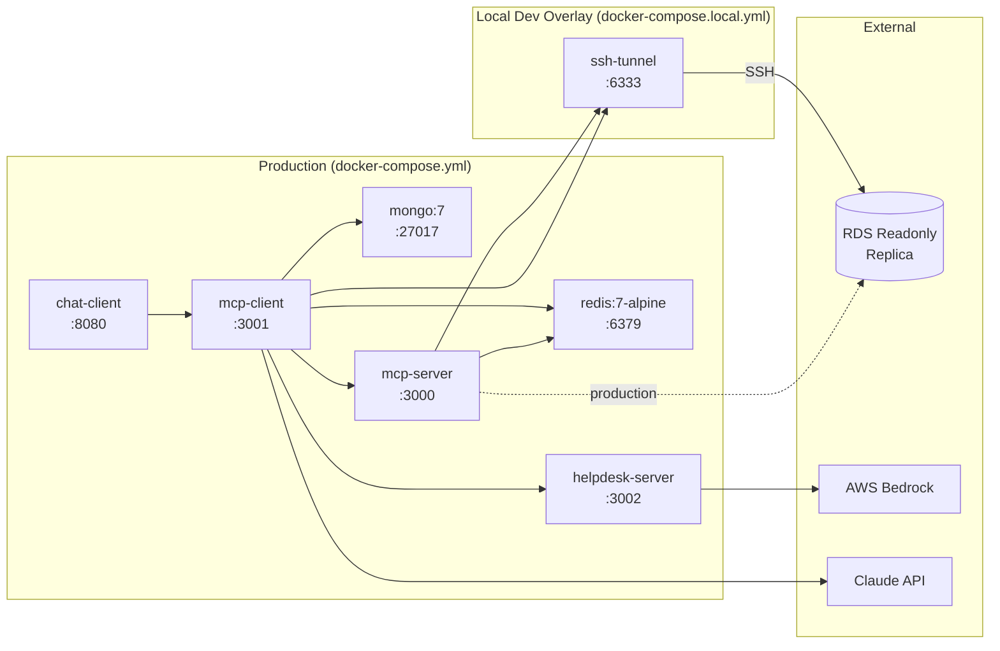

---

## Services Overview

| Service | Port | Image | Role |
|---------|------|-------|------|
| **chat-client** | 8080 | nginx:alpine | React SPA, Google OAuth login |
| **mcp-client** | 3001 | node:20-alpine | Claude orchestration, session management |
| **mcp-server** | 3000 | node:20-alpine | Database query tools via MCP protocol |
| **helpdesk-server** | 3002 | node:20-alpine | AWS Bedrock Knowledge Base via MCP protocol |
| **mongo** | 27017 | mongo:7 | Chat sessions, messages, auth sessions |
| **redis** | 6379 | redis:7-alpine | Shared cache (user ACLs, tool lists, query results) |
| **ssh-tunnel** | 6333 | alpine (local only) | SSH tunnel to RDS readonly replica |

### Dependency Chain

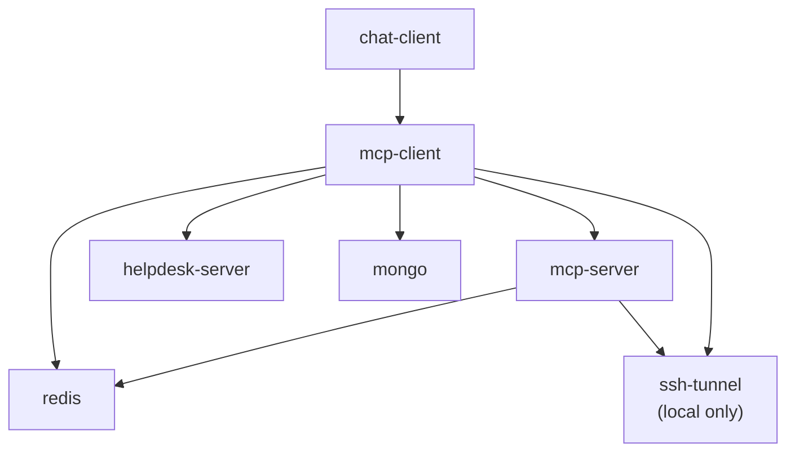

All services use `service_healthy` health checks to ensure proper startup order.

---

## MCP Server — Database Context Tools

**Source:** `lohono-mcp-server/src/`
**Entrypoints:** `index-sse.ts` (SSE transport), `index.ts` (stdio transport)

The MCP Server exposes 20+ tools for database exploration, querying, and business intelligence.

### Tool Categories

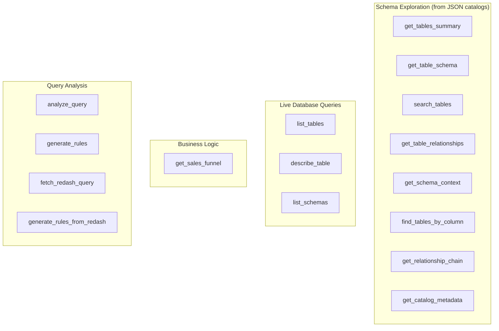

### Read-Only Enforcement

Every SQL query is wrapped in a read-only transaction with a 30-second timeout:

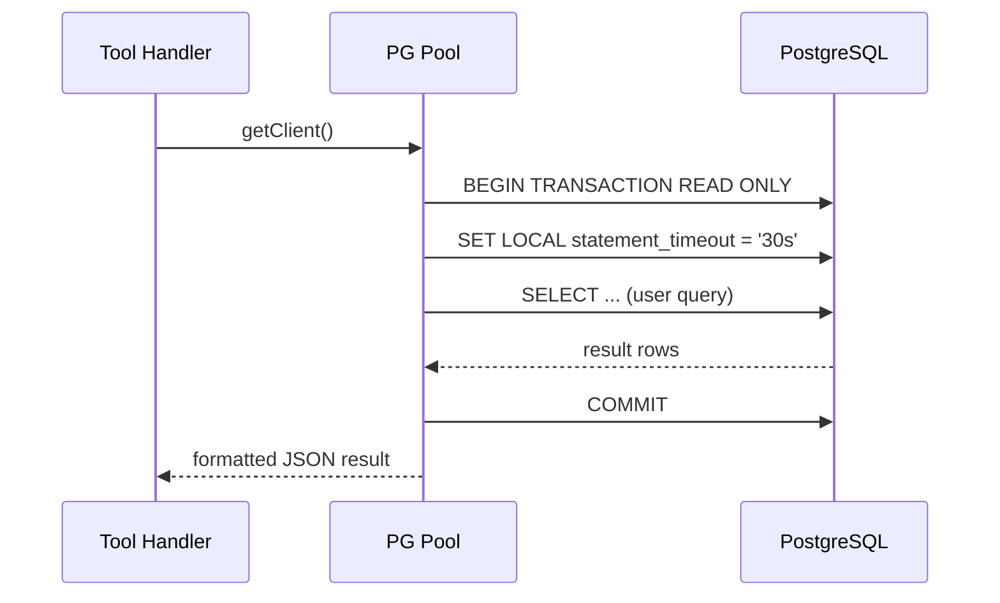

### Tool Plugin System

Tools use a modular **plugin architecture** defined in `tools/`:

1. Define a `ToolPlugin` in a plugin file (e.g., `tools/sales-funnel.plugin.ts`)
2. Each plugin bundles a `ToolDefinition` (JSON Schema) and a handler function
3. Register plugins via `registerPlugins()` in `tools/registry.ts`
4. The registry dispatches tool calls to the correct plugin after ACL enforcement

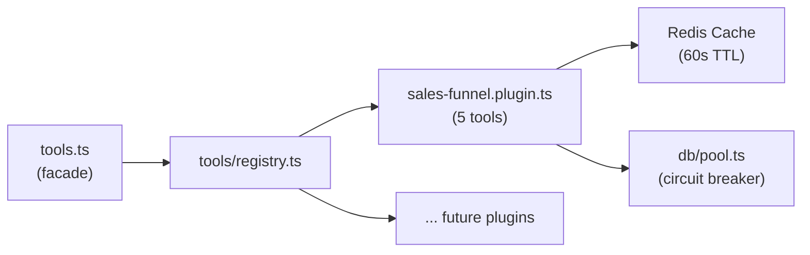

Both transport entrypoints (`index.ts`, `index-sse.ts`) register the same tool definitions and handler via the facade in `tools.ts`.

---

## Helpdesk Server — Knowledge Base Tools

**Source:** `lohono-helpdesk-server/src/`
**Entrypoint:** `index-sse.ts`

A lightweight MCP server that queries AWS Bedrock Knowledge Base for non-data questions.

### Knowledge Base Coverage

- Company policies and procedures
- Standard Operating Procedures (SOPs)
- Villa and property information
- Guest guidelines and documentation
- **Goa DCR (Development Control Regulations)**
  - FAR/FSI (Floor Area Ratio / Floor Space Index)
  - Setbacks and zoning regulations
  - Parking requirements and fire safety norms
  - Building heights and plot coverage
  - Sub-division rules and land development regulations

### Query Flow

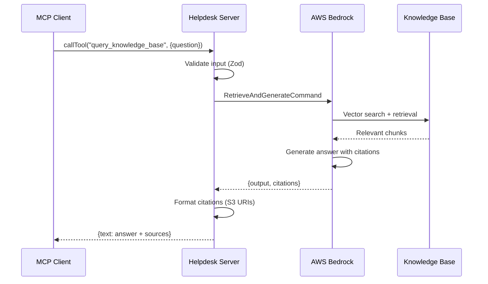

### CLI Testing

```bash
# Test knowledge base queries from the command line
npx tsx lohono-helpdesk-server/src/cli-query-kb.ts "What is the FAR for residential zones in Goa?"
```

---

## MCP Client — Claude Orchestration

**Source:** `lohono-mcp-client/src/`
**Entrypoint:** `index.ts`

The MCP Client is the central orchestration layer. It connects to MongoDB for persistence, PostgreSQL for auth, and multiple MCP servers for tools.

### Agentic Loop

Claude operates in a loop of up to 20 rounds. Each round, Claude can call tools or produce a final text answer. Message history is **windowed** to the most recent 50 messages to control token costs.

Two execution modes are available:

- **`chat()`** — Batch mode: returns the complete response after all rounds finish
- **`chatStream()`** — SSE streaming mode: yields `StreamEvent` objects as an async generator, enabling real-time text deltas and tool progress updates in the UI

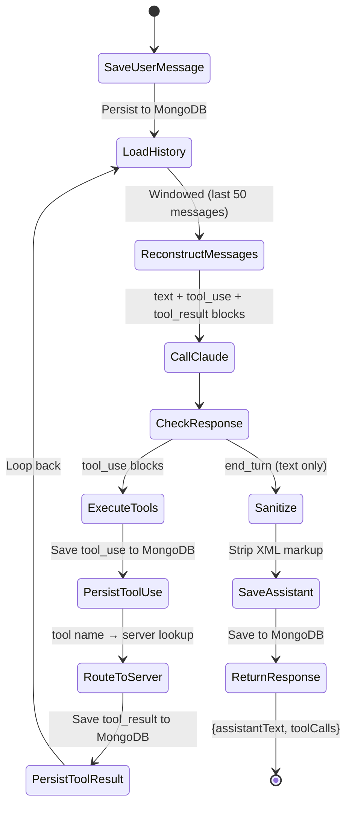

### SSE Streaming Events

The streaming endpoint (`GET /api/sessions/:id/messages/stream`) emits these event types:

| Event | Data | Description |
|-------|------|-------------|
| `text_delta` | `{ text }` | Incremental text chunk from Claude |
| `tool_start` | `{ name, id }` | Tool execution began |
| `tool_end` | `{ name, id }` | Tool execution completed |
| `done` | `{ assistantText }` | All rounds complete, final text |
| `error` | `{ message }` | Error occurred during processing |

### System Prompt Routing

The system prompt instructs Claude on how to route questions:

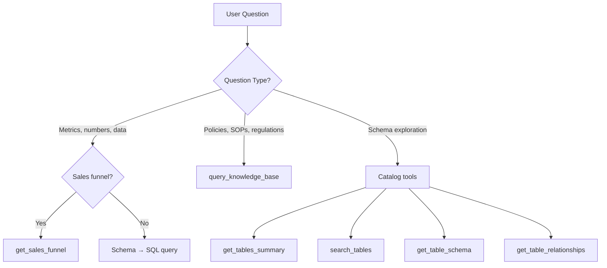

### Message Persistence

Every step is persisted to MongoDB, enabling full conversation replay:

| Role | Content | Purpose |
|------|---------|---------|
| `user` | Natural language question | User's input |
| `assistant` | Claude's text response | Final answer |
| `tool_use` | Tool name + arguments | Claude's tool call request |
| `tool_result` | Tool output JSON | Server's tool response |

Messages are reconstructed into Claude's API format (`dbMessagesToClaudeMessages()`) on each API call, preserving multi-turn context.

---

## Multi-MCP Server Routing

**Source:** `lohono-mcp-client/src/mcp-bridge.ts`

The MCP Client supports connecting to multiple MCP servers simultaneously. Tool calls are routed automatically based on a tool-to-server registry.

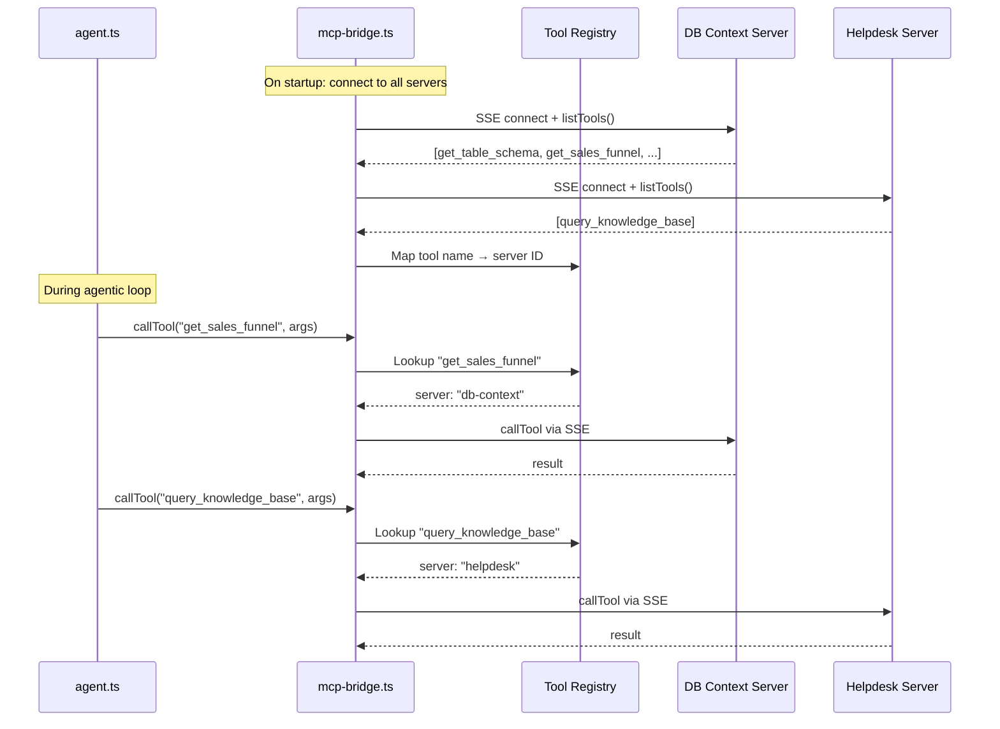

### Server Configuration

Servers are configured in `lohono-mcp-client/src/index.ts`:

```typescript
const mcpConfigs: MCPServerConfig[] = [
  { id: "db-context", sseUrl: process.env.MCP_SSE_URL },
];
// Dynamically add helpdesk if configured
if (process.env.HELPDESK_SSE_URL) {
  mcpConfigs.push({ id: "helpdesk", sseUrl: process.env.HELPDESK_SSE_URL });
}
```

Tool lists are cached per user in Redis with a 5-minute TTL. ACL filtering is applied based on the user's permissions.

### Resilience Features

The MCP bridge includes several resilience mechanisms:

- **Circuit breakers** — Per-server circuit breakers (5-failure threshold, 30s reset) prevent cascading failures when an MCP server is down
- **Auto-reconnection** — On connection failure, the bridge triggers background reconnection with exponential backoff (1s → 60s, max 10 attempts)
- **Redis-backed caching** — User tool lists are cached in Redis (with in-memory fallback) to avoid repeated tool discovery calls

---

## Authentication and Authorization

### Auth Flow

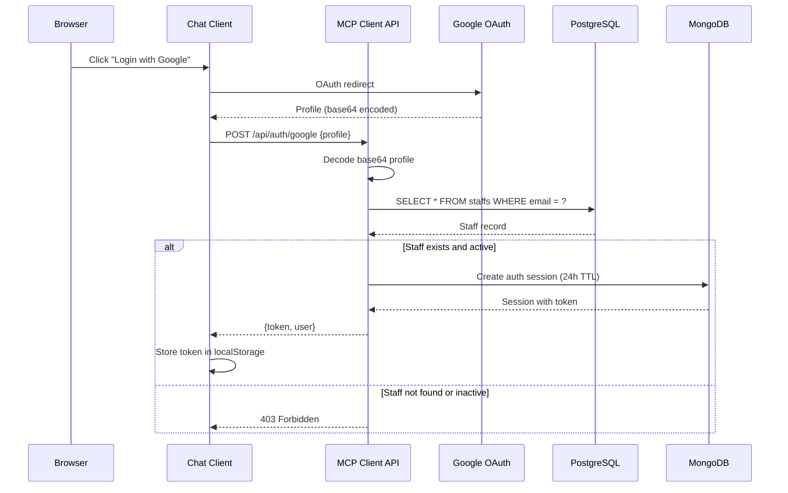

### Session Expiry

Auth sessions use a **sliding-window TTL** of 24 hours:
- Each session has an `expiresAt` field set 24 hours from creation
- On every `validateSession()` call, `expiresAt` is refreshed (sliding window)
- MongoDB TTL index auto-deletes expired session documents
- Sessions include `lastAccessedAt` for audit tracking

### User Email Resolution

User identity is resolved from three sources (priority order):

1. `_meta.user_email` in MCP request params (set by MCP Client)
2. `X-User-Email` HTTP header (SSE connection)
3. `MCP_USER_EMAIL` environment variable (fallback for stdio mode)

---

## Access Control (ACL)

**Source:** `lohono-mcp-server/src/acl/` (modular subsystem, re-exported via `acl.ts` barrel)
**Config:** `database/schema/acl.yml`

Tool access is controlled per-user based on ACL arrays stored in the `staffs.acl_array` PostgreSQL column. ACLs are cached in Redis (with in-memory fallback) for 5 minutes. The ACL subsystem is split into focused modules: `types.ts`, `config.ts`, `email-resolver.ts`, `evaluator.ts`, and `user-cache.ts`.

### ACL Evaluation Flow

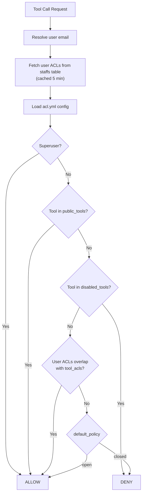

### ACL Configuration Structure

```yaml
# database/schema/acl.yml
default_policy: open           # Allow by default if no rule matches
superuser_acls: [superadmin]   # ACLs that bypass all checks
public_tools:                  # Tools accessible to all authenticated users
  - list_tables
  - get_tables_summary
  - search_tables
  - get_table_schema
  # ...
disabled_tools: []             # Tools disabled for everyone
tool_acls:                     # Tool → required ACLs mapping
  get_sales_funnel:
    - sales_admin
    - executive
  analyze_query:
    - data_engineer
    - admin
```

---

## Database Catalog System

**Source:** `lohono-mcp-server/src/database-catalog.ts`
**Data:** `database/schema/database-catalog.json`, `database/schema/foreign-keys-catalog.json`

Schema intelligence comes from pre-built JSON catalogs loaded once at startup, avoiding repeated `information_schema` queries.

### Catalog Architecture

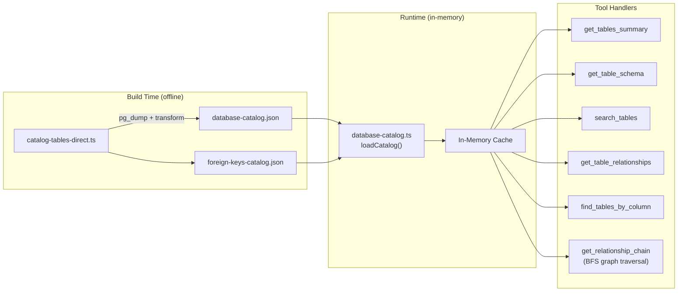

### Catalog Data Formats

**database-catalog.json** — Table definitions:
```json
[{
  "schema": "public",
  "name": "development_opportunities",
  "type": "TABLE",
  "columns": [{
    "column_name": "id",
    "data_type": "uuid",
    "is_nullable": "NO",
    "column_default": "gen_random_uuid()"
  }]
}]
```

**foreign-keys-catalog.json** — Relationships with business context:
```json
{
  "foreign_keys": [{
    "table": "development_opportunities",
    "column": "id",
    "references_table": "stage_histories",
    "references_column": "leadable_id",
    "relationship_type": "has_many",
    "cardinality": "1:N",
    "business_context": "Tracks stage progression of leads",
    "polymorphic": true,
    "polymorphic_type_column": "leadable_type",
    "polymorphic_type_value": "Development::Opportunity"
  }]
}
```

### Regenerating Catalogs

```bash
npx tsx database/scripts/catalog-tables-direct.ts
```

This connects to PostgreSQL, dumps schema metadata, and writes the JSON files to `database/schema/`.

---

## Sales Funnel Tool

**Source:** `lohono-mcp-server/src/tools/sales-funnel.plugin.ts` (plugin), `lohono-mcp-server/src/sales-funnel-builder.ts` (SQL builders)

The `get_sales_funnel` tool is a dedicated MCP tool with parameterized SQL that computes four metrics: **Leads, Prospects, Accounts, and Sales** for any date range. Query results are cached in Redis with a 60-second TTL.

### Why a Dedicated Tool?

The sales funnel SQL is too complex for Claude to reliably generate. It involves:

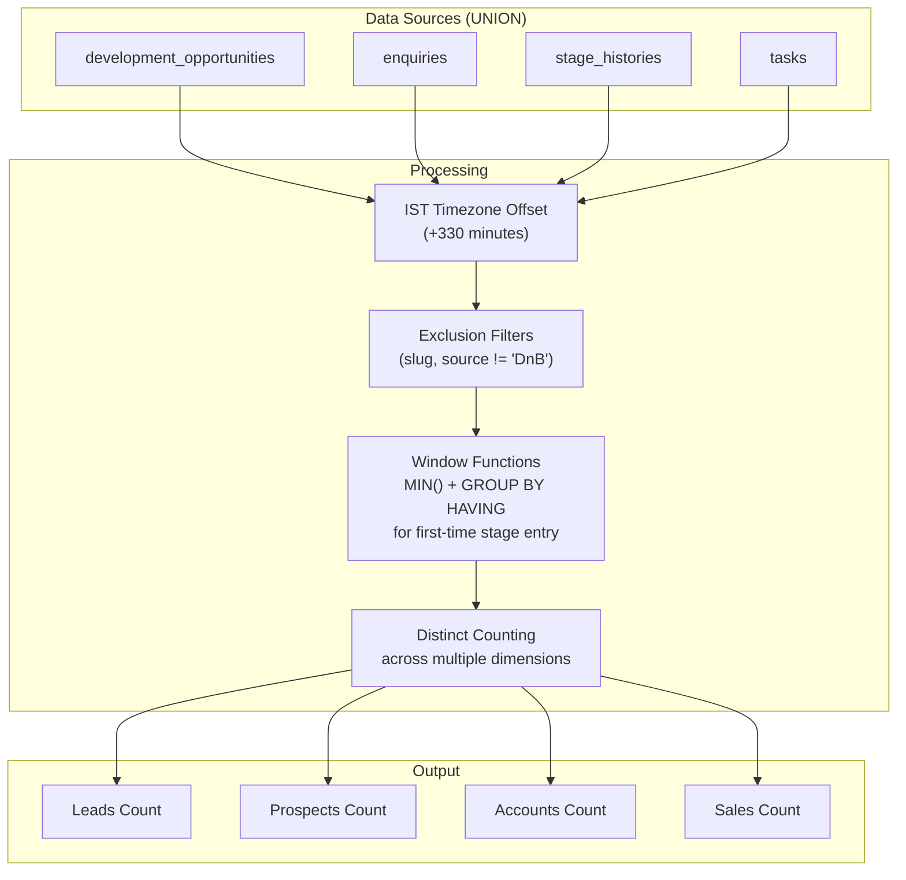

### Parameterized Queries

All sales funnel SQL uses **parameterized queries** (`$1`, `$2`, etc.) to prevent SQL injection. The `ParameterizedQuery` type bundles SQL with its parameter values:

```typescript
interface ParameterizedQuery {
  sql: string;
  params: unknown[];
}
```

Slug exclusions and source filters (e.g., DnB) are passed as parameters rather than interpolated into SQL strings.

### Usage

The tool accepts `start_date` and `end_date` parameters in `YYYY-MM-DD` format and returns all four metrics in a single call. Results are cached in Redis for 60 seconds.

---

## NLQ Resolution Pipeline

**Source:** `lohono-mcp-server/src/nlq-resolver/`

The NLQ (Natural Language Query) resolver provides intent detection and resolution for common query patterns.

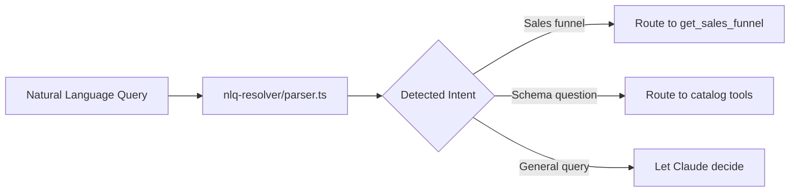

The resolver uses pattern matching and keyword detection to pre-classify queries before they reach Claude, enabling faster routing for common question types.

---

## Time Range Parsing

**Source:** `lohono-mcp-server/src/time-range/parser.ts`

Converts natural language time expressions into concrete date ranges:

| Expression | Resolved Range |
|------------|---------------|
| `MTD` | First of current month → today |
| `YTD` | January 1 → today |
| `last quarter` | Previous quarter start → end |
| `last 30 days` | 30 days ago → today |
| `last month` | Previous month start → end |
| `between X and Y` | Explicit date range |
| `January 2025` | 2025-01-01 → 2025-01-31 |

The parser is used by the sales funnel tool and other query tools to resolve time expressions from user queries into `start_date` / `end_date` parameters.

---

## Chat Client

**Source:** `lohono-chat-client/src/`

React SPA built with Vite and Tailwind CSS, served via nginx in production.

### Component Architecture

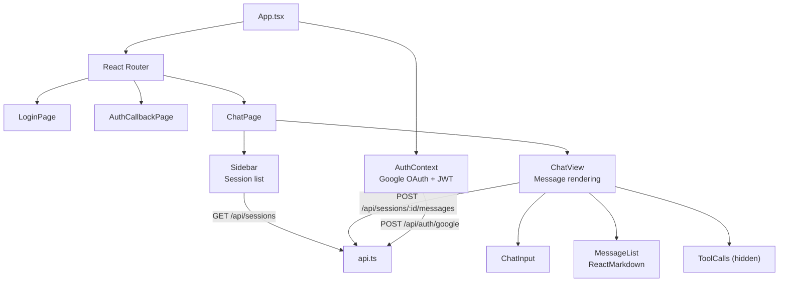

### Message Display

- Only `user` and `assistant` messages are shown
- `tool_use` and `tool_result` messages are hidden from the UI
- SQL queries are rendered in syntax-highlighted code blocks
- Data tables are rendered as HTML tables via ReactMarkdown
- Responses use a typewriter animation effect

---

## Observability

**Source:** `shared/observability/src/`

Full distributed tracing and structured logging via OpenTelemetry + SigNoz.

### Instrumentation Stack

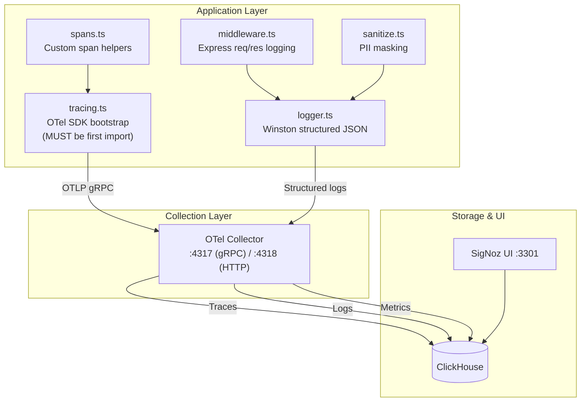

### Span Types

| Span Helper | Wraps | Key Attributes |
|-------------|-------|----------------|
| `withClaudeSpan` | Claude API calls | `model`, `token_count`, `stop_reason` |
| `withMCPToolSpan` | MCP tool calls | `tool.name`, `tool.server`, `tool.duration_ms` |
| `withDBSpan` | PostgreSQL queries | `db.system`, `db.statement`, `db.duration_ms` |
| `withSpan` | Generic operations | Custom attributes |

### Structured Log Format

Every log line includes correlation fields for tracing:

```json
{
  "level": "info",
  "message": "HTTP 200 POST /api/sessions/abc/messages",
  "service": "lohono-mcp-client",
  "trace_id": "a1b2c3d4e5f6...",
  "span_id": "1a2b3c4d...",
  "timestamp_ist": "16/02/2026, 14:30:00.123",
  "user_email": "user@isprava.com",
  "duration_ms": 4523
}
```

### Enabling Observability

```bash
# Start the observability stack
make obs-up

# Set OTEL_SDK_DISABLED=false in .env, then restart services
make deploy-all   # or: OTEL_SDK_DISABLED=false docker compose up -d --build
```

---

## Deployment Modes

Two deployment modes controlled by `DEPLOYMENT_MODE` in `.env`:

### Local Development

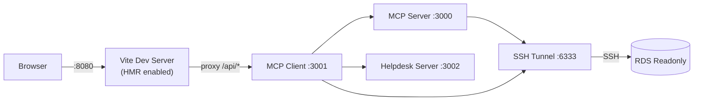

- `make up` / `make up-d` — uses `docker-compose.local.yml` overlay
- SSH tunnel routes DB connections through bastion host
- Vite dev server with hot module replacement
- `DB_HOST` and `DB_PORT` automatically overridden to use tunnel

### Production

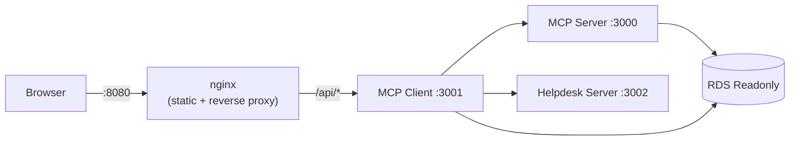

- `make deploy` — uses only `docker-compose.yml`
- nginx serves static React build and proxies API requests
- Direct database connection via `DB_HOST` / `DB_PORT`
- No SSH tunnel

---

## SSH Tunnel for Local Development

**Config:** `docker-compose.local.yml`, `Dockerfile.tunnel`

The SSH tunnel container creates an encrypted connection from your local Docker network to the RDS readonly replica.

### How It Works

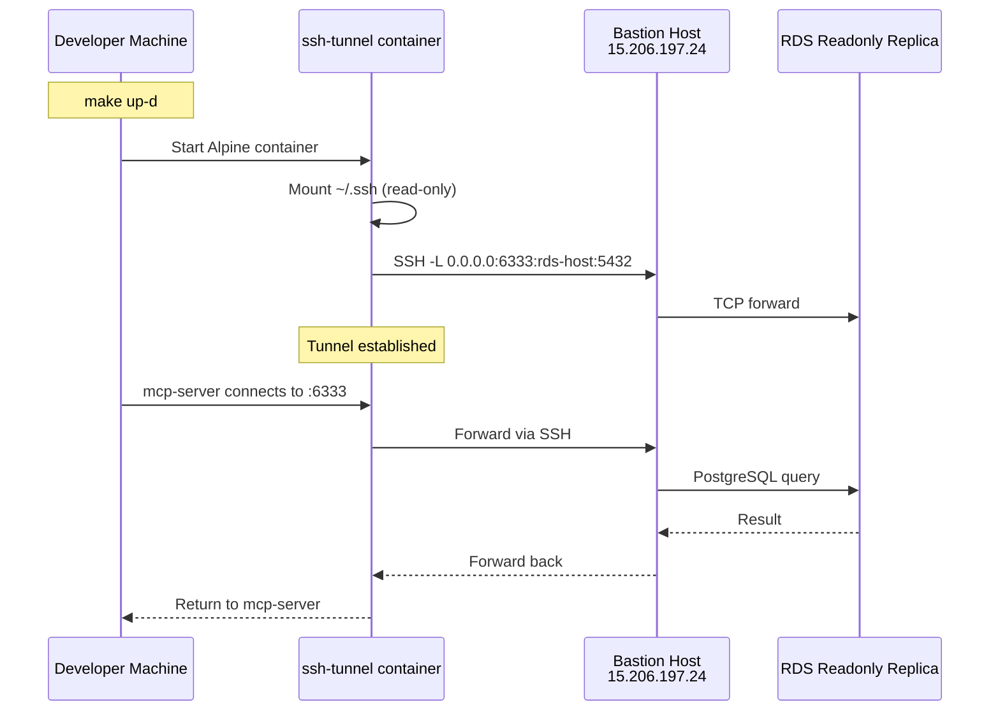

### Prerequisites

- SSH key pair in `~/.ssh/` that is authorized on the bastion host (`ubuntu@15.206.197.24`)
- The bastion host must have network access to the RDS endpoint

### Configuration

The tunnel is defined in `docker-compose.local.yml`:
- **Forward:** `0.0.0.0:6333` → `lohono-api-readonly...rds.amazonaws.com:5432`
- **Health check:** `nc -z localhost 6333` (every 10s)
- **Keep-alive:** `ServerAliveInterval=30`, `ServerAliveCountMax=3`
- **Auto-restart:** `restart: unless-stopped`

The overlay also overrides `DB_HOST=ssh-tunnel` and `DB_PORT=6333` for `mcp-server` and `mcp-client`.

---

## End-to-End Request Flow

Complete flow from user question to rendered answer:

```mermaid
sequenceDiagram
    actor User as User
    participant Chat as Chat Client
    participant API as MCP Client :3001
    participant Mongo as MongoDB
    participant Claude as Claude API
    participant MCP as MCP Server :3000
    participant HD as Helpdesk :3002
    participant PG as PostgreSQL
    participant KB as Bedrock KB

    User->>Chat: Types question
    Chat->>API: POST /api/sessions/:id/messages
    Note over API: JWT auth + session validation

    API->>Mongo: appendMessage("user", message)
    API->>Mongo: getMessages(sessionId)
    API->>API: dbMessagesToClaudeMessages(history)

    loop Agentic Loop (max 20 rounds)
        API->>Claude: messages.create(system, tools, history)

        alt Claude calls a DB tool
            Claude-->>API: tool_use: get_sales_funnel
            API->>Mongo: appendMessage("tool_use", ...)
            API->>MCP: callTool("get_sales_funnel", args)
            MCP->>PG: READ ONLY SQL query
            PG-->>MCP: rows
            MCP-->>API: {content: [{text: "..."}]}
            API->>Mongo: appendMessage("tool_result", ...)

        else Claude calls knowledge base
            Claude-->>API: tool_use: query_knowledge_base
            API->>Mongo: appendMessage("tool_use", ...)
            API->>HD: callTool("query_knowledge_base", args)
            HD->>KB: RetrieveAndGenerate
            KB-->>HD: answer + citations
            HD-->>API: {content: [{text: "..."}]}
            API->>Mongo: appendMessage("tool_result", ...)

        else Claude produces final answer
            Claude-->>API: text (stop_reason="end_turn")
            API->>API: sanitizeAssistantText(text)
            API->>Mongo: appendMessage("assistant", text)
        end
    end

    API-->>Chat: {assistantText, toolCalls}
    Chat->>Chat: Render with ReactMarkdown
    Chat-->>User: Formatted answer with tables, SQL blocks
```

---

## Circuit Breakers

**Source:** `shared/circuit-breaker/src/`

Circuit breakers prevent cascading failures across the platform. They follow the standard **closed → open → half-open** state machine.

```mermaid
stateDiagram-v2
    [*] --> Closed
    Closed --> Open: Failure threshold reached
    Open --> HalfOpen: Reset timeout elapsed
    HalfOpen --> Closed: Probe succeeds
    HalfOpen --> Open: Probe fails
```

### Circuit Breaker Instances

| Instance | Location | Threshold | Reset Timeout | Purpose |
|----------|----------|-----------|---------------|---------|
| `claude-api` | `agent.ts` | 3 failures | 60s | Protects against Claude API outages |
| `mcp-<serverId>` | `mcp-bridge.ts` | 5 failures | 30s | Per-server MCP connection protection |
| `postgresql` | `db/pool.ts` | 5 failures | 30s | Database connection protection |

Circuit breaker states are exposed via health check endpoints:
- `GET /api/health` → `circuits.claude`, `circuits.mcp.*`
- `GET /health` → `circuits.postgresql`

---

## Redis Cache Layer

**Source:** `shared/redis/src/`

Redis provides a shared cache layer used across MCP Server and MCP Client. The `RedisCache<T>` class provides a typed caching abstraction with automatic fallback to in-memory `Map` when Redis is unavailable.

### Cache Instances

| Cache Key Prefix | TTL | Used By | Purpose |
|------------------|-----|---------|---------|
| `tools:user` | 5 min | `mcp-bridge.ts` | Per-user filtered tool lists |
| `acl:user` | 5 min | `acl/user-cache.ts` | User ACL arrays from staffs table |
| `funnel:*` | 60s | `sales-funnel.plugin.ts` | Sales funnel query results |

### Fallback Behavior

If `REDIS_URL` is not set or Redis is unreachable, all caches fall back to in-memory `Map` storage. This ensures the platform works without Redis, though cache is not shared across processes.

---

## Rate Limiting

**Source:** `lohono-mcp-client/src/server.ts`

The MCP Client API enforces rate limits using `express-rate-limit`:

| Limiter | Scope | Limit | Key |
|---------|-------|-------|-----|
| General | All `/api/*` (except health) | 60 req/min | User email or IP |
| Chat | `POST /api/sessions/:id/messages` and SSE stream | 20 req/min | User email or IP |

Rate limit headers follow the `draft-7` standard (`RateLimit-Limit`, `RateLimit-Remaining`, `RateLimit-Reset`).

---

## Testing

**Source:** `vitest.config.ts`, `lohono-mcp-server/src/__tests__/`, `lohono-mcp-client/src/__tests__/`

Tests use **Vitest** as the test runner:

```bash
npm test          # Run all tests once
npm run test:watch # Watch mode
```

---

## Key Design Decisions

1. **Claude IS the NLP engine** — No separate intent classifier or NLP-to-SQL translator. Claude autonomously explores the schema and generates SQL.

2. **Multi-MCP server architecture** — Separates concerns: database tools and knowledge base tools run as independent MCP servers, connected via a routing bridge with auto-reconnection.

3. **Read-only database access** — All queries run inside `BEGIN TRANSACTION READ ONLY` with a 30-second timeout, protected by a circuit breaker.

4. **Pre-built schema catalog** — Schema and FK lookups read from JSON files loaded at startup, not live `information_schema` queries.

5. **Sales funnel as a dedicated tool** — The funnel SQL is too complex for Claude to reliably generate, so it uses parameterized queries with correct IST timezone handling, multi-source UNIONs, and window functions. Results are cached in Redis (60s TTL).

6. **ACL at the tool level** — Each tool call is validated against the user's `acl_array` from the `staffs` table, cached in Redis for 5 minutes.

7. **External database** — No local PostgreSQL; all environments connect to external databases (RDS in production, via SSH tunnel for local dev).

8. **Windowed message history** — Only the most recent 50 messages are sent to Claude, controlling token costs while preserving context.

9. **Text sanitization** — XML markup and internal tool mechanics are stripped from Claude's responses before reaching the user.

10. **Observability-first** — OpenTelemetry traces are emitted for every Claude call, tool execution, and DB query, exported to SigNoz via OTLP/gRPC.

11. **SSE streaming** — Real-time response streaming via Server-Sent Events, delivering text deltas and tool progress to the UI as they happen.

12. **Circuit breakers everywhere** — Claude API, MCP server connections, and PostgreSQL are all protected by circuit breakers to prevent cascading failures.

13. **Modular plugin system** — Tools are defined as plugins with their own definition and handler, registered via a central registry. This simplifies adding new tools.

14. **Redis with graceful degradation** — Redis provides shared caching but is optional. All caches fall back to in-memory `Map` when Redis is unavailable.

15. **Rate limiting** — API endpoints are rate-limited (60 req/min general, 20 req/min for chat) to prevent abuse and control Claude API costs.
