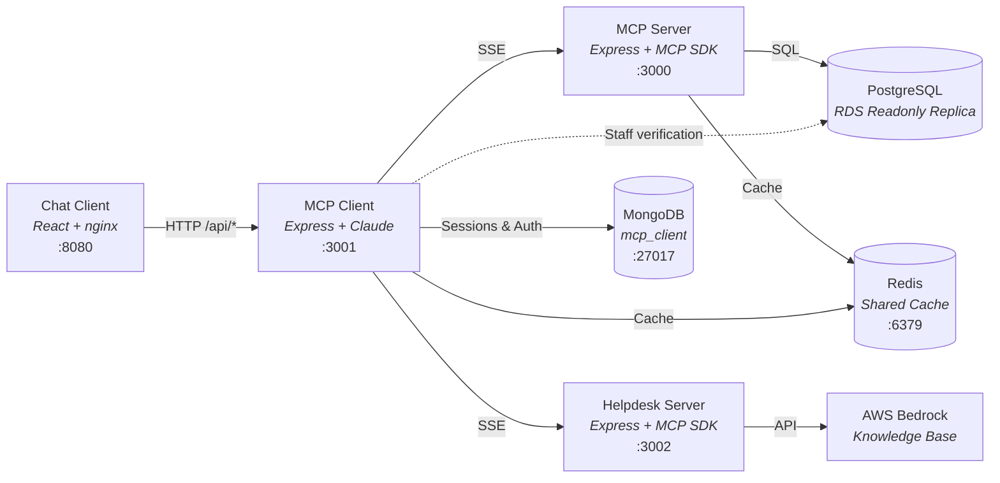
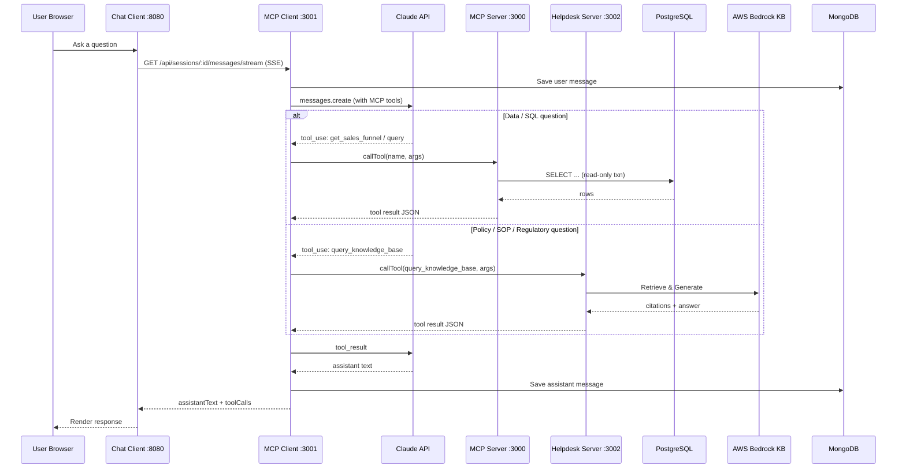
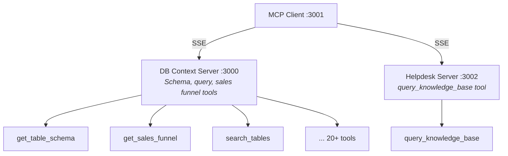
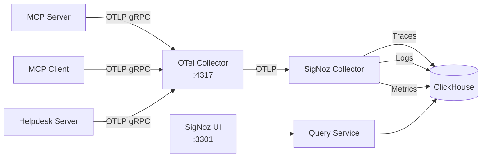
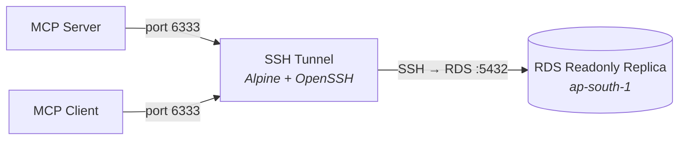

# Lohono AI — Database Context MCP Platform

An AI-powered data analyst for Isprava, Chapter and Lohono Stays. Users ask natural-language questions via a web UI, which are answered by Claude using MCP tools that query the production PostgreSQL database and an AWS Bedrock Knowledge Base for operational documentation.

## Architecture



### Request Flow



### Multi-MCP Server Routing

The MCP Client connects to multiple MCP servers simultaneously. Tool calls are routed to the correct server automatically based on which server registered the tool.



### Observability Flow



### Local Development — SSH Tunnel

For local development, database connections route through an SSH tunnel to the RDS readonly replica. This is handled automatically by `docker-compose.local.yml`.



**Services:**

- **Chat Client** — React SPA served via nginx. Handles Google OAuth login and provides a streaming chat interface with real-time SSE responses.
- **MCP Client** — Express REST API. Manages sessions (MongoDB), authenticates users (Google OAuth + staff check in Postgres), and orchestrates Claude to answer questions using MCP tools from multiple servers. Includes rate limiting, circuit breakers, and SSE streaming.
- **MCP Server** — Express SSE server implementing the Model Context Protocol. Exposes database query tools via a modular plugin system, schema intelligence, Redash integration, and ACL enforcement. Uses Redis caching for query results and user ACLs.
- **Helpdesk Server** — Express SSE server implementing MCP. Queries AWS Bedrock Knowledge Base for policies, SOPs, villa information, Goa DCR/building regulations, and operational documentation.
- **PostgreSQL** — Lohono production database (`lohono_api_production`) via external RDS readonly replica.
- **MongoDB** — Stores chat sessions, messages, and auth sessions (with TTL-based auto-expiry).
- **Redis** — Shared cache layer for user ACLs, tool lists, and query results. Optional — falls back to in-memory caching if unavailable.

## Prerequisites

- **Docker** and **Docker Compose** (v2)
- **Node.js 20+** and **npm** (for local development only)
- An **Anthropic API key** (Claude access)
- An external **PostgreSQL** database (RDS or self-hosted)
- **AWS credentials** with Bedrock access (for helpdesk features)
- **SSH key** access to the bastion host (for local development SSH tunnel)

## Getting Started

### 1. Clone and configure

```bash
git clone <repo-url>
cd lohono-db-context

# Create .env from the template
cp .env.example .env
```

Edit `.env` and fill in the **required** values (see [Environment Variables](#environment-variables) below).

### 2. Start everything

```bash
# Local development (with SSH tunnel to RDS)
make up-d

# Production deployment (direct DB connection)
make deploy
```

The web UI will be available at **http://localhost:8080**.

## Environment Variables

All configuration lives in `.env`. Copy from `.env.example` and fill in the required values:

### PostgreSQL (External)

| Variable | Required | Default | Description |
|----------|----------|---------|-------------|
| `DB_HOST` | **Yes** | — | External database hostname (overridden to `ssh-tunnel` for local dev) |
| `DB_PORT` | | `5432` | PostgreSQL port (overridden to `6333` for local dev) |
| `DB_USER` | | `lohono_api` | PostgreSQL username |
| `DB_PASSWORD` | **Yes** | — | PostgreSQL password |
| `DB_NAME` | | `lohono_api_production` | PostgreSQL database name |

### MongoDB

| Variable | Required | Default | Description |
|----------|----------|---------|-------------|
| `MONGO_PORT` | | `27017` | Host port for MongoDB |
| `MONGODB_DB_NAME` | | `mcp_client` | MongoDB database name for sessions |

### Redis (Shared Cache)

| Variable | Required | Default | Description |
|----------|----------|---------|-------------|
| `REDIS_URL` | | — | Redis connection URL (e.g. `redis://redis:6379`). If not set, falls back to in-memory caching |
| `REDIS_PORT` | | `6379` | Host port for direct Redis access |

### MCP Server

| Variable | Required | Default | Description |
|----------|----------|---------|-------------|
| `MCP_PORT` | | `3000` | Host port for the MCP SSE server |
| `REDASH_URL` | | — | Redash instance URL (optional) |
| `REDASH_API_KEY` | | — | Redash API key (optional) |
| `MCP_USER_EMAIL` | | — | Fallback email for ACL in stdio mode |

### Helpdesk Server (AWS Bedrock Knowledge Base)

| Variable | Required | Default | Description |
|----------|----------|---------|-------------|
| `HELPDESK_PORT` | | `3002` | Host port for helpdesk MCP server |
| `BEDROCK_KB_ID` | **Yes** | — | AWS Bedrock Knowledge Base ID |
| `BEDROCK_MODEL_ARN` | | — | Bedrock model ARN for generation (optional) |
| `AWS_REGION` | | `ap-south-1` | AWS region for Bedrock |
| `AWS_ACCESS_KEY_ID` | **Yes** | — | AWS access key |
| `AWS_SECRET_ACCESS_KEY` | **Yes** | — | AWS secret key |
| `HELPDESK_SSE_URL` | | `http://helpdesk-server:3002` | MCP Client to Helpdesk Server URL |

### MCP Client

| Variable | Required | Default | Description |
|----------|----------|---------|-------------|
| `ANTHROPIC_API_KEY` | **Yes** | — | Claude API key from Anthropic |
| `CLAUDE_MODEL` | | `claude-sonnet-4-5-20250929` | Claude model to use |
| `CLIENT_PORT` | | `3001` | Host port for the MCP client REST API |

### Web Frontend & Deployment

| Variable | Required | Default | Description |
|----------|----------|---------|-------------|
| `WEB_PORT` | | `8080` | Host port for the web UI |
| `DEPLOYMENT_MODE` | | `local` | `local` (Vite proxy) or `production` (nginx proxy) |
| `PUBLIC_DOMAIN` | | `ailabs.lohono.com` | Public domain (production mode only) |

### Observability

| Variable | Required | Default | Description |
|----------|----------|---------|-------------|
| `OTEL_SDK_DISABLED` | | `true` | Set to `false` when running `make obs-up` |
| `OTEL_EXPORTER_OTLP_ENDPOINT` | | `http://otel-collector:4317` | OpenTelemetry Collector endpoint |
| `SIGNOZ_PORT` | | `3301` | Host port for SigNoz UI |
| `LOG_LEVEL` | | `info` | Log level: `debug`, `info`, `warn`, `error` |
| `NODE_ENV` | | `production` | Environment tag for traces |

## Running Services

### Run all services at once (Docker)

```bash
# Local development — with SSH tunnel (foreground)
make up

# Local development — with SSH tunnel (background)
make up-d

# Production — direct DB connection (background)
make deploy

# Stop everything
make down
```

> **Note:** `make up` / `make up-d` automatically include the SSH tunnel via `docker-compose.local.yml`. `make deploy` uses only `docker-compose.yml` for direct database connections.

### Run individual services

Each command starts the service and its dependencies:

```bash
make mongo              # MongoDB only
make mcp-server         # MCP Server (requires external DB via .env)
make helpdesk-server    # Helpdesk MCP Server (requires AWS credentials)
make mcp-client         # MongoDB + MCP Server + Helpdesk Server + Client
make chat-client        # All services including chat frontend
```

### Manage individual services

```bash
make service-up SERVICE=mcp-server      # Rebuild and start a single service
make service-down SERVICE=mcp-server    # Stop and remove a single service
```

### Local development (no Docker for app code)

Start databases in Docker, then run app services locally with hot-reload:

```bash
# Terminal 1 — databases
make mongo

# Terminal 2 — MCP Server (port 3000)
make dev-server

# Terminal 3 — MCP Client API (port 3001)
make dev-client

# Terminal 4 — Chat Client dev server (port 8080)
make dev-chat-client
```

Or just run `make dev` to see these instructions.

**Install dependencies first** (one-time):

```bash
make dev-install
```

> For local development, ensure `DB_*` vars in `.env` point to your external PostgreSQL instance.

## Accessing Services

| Service | URL | Description |
|---------|-----|-------------|
| Chat Client | http://localhost:8080 | Chat interface (login via Google OAuth) |
| MCP Client API | http://localhost:3001/api/health | REST API for sessions and chat |
| MCP Server | http://localhost:3000/health | MCP SSE server health check |
| Helpdesk Server | http://localhost:3002/health | Helpdesk MCP server health check |
| MCP SSE Endpoint | http://localhost:3000/sse | SSE transport for MCP protocol |
| Helpdesk SSE Endpoint | http://localhost:3002/sse | SSE transport for helpdesk MCP |
| MongoDB | `localhost:27017` | Direct Mongo access |
| Redis | `localhost:6379` | Direct Redis access |
| SigNoz UI | http://localhost:3301 | Observability dashboard (if running) |

### Database shells

```bash
make db-shell       # psql shell into external PostgreSQL
make mongo-shell    # mongosh shell into MongoDB
```

## Deployment

### Quick production deployment

```bash
# 1. Configure environment
cp .env.example .env
# Edit .env — set ANTHROPIC_API_KEY, DB_HOST, DB_PASSWORD, AWS keys, etc.

# 2. Deploy all services
make deploy
```

This builds all Docker images and starts everything in detached mode. Output shows the URLs for each service.

### Full deployment with observability (SigNoz + OpenTelemetry)

```bash
make deploy-all
```

This starts the observability stack (ClickHouse, SigNoz, OTel Collector) first, then the application services with `OTEL_SDK_DISABLED=false`. All traces and structured logs from the MCP Server, Helpdesk Server, and Client are sent to SigNoz automatically.

### Deploy observability stack separately

```bash
make obs-up         # Start SigNoz + OTel Collector
make obs-down       # Stop observability stack
make obs-ps         # Check status
```

### Zero-downtime updates

To update a single service without downtime:

```bash
# Rebuild and restart just the MCP client
docker compose up -d --build --no-deps mcp-client

# Rebuild and restart just the MCP server
docker compose up -d --build --no-deps mcp-server

# Rebuild and restart just the helpdesk server
docker compose up -d --build --no-deps helpdesk-server

# Rebuild and restart just the chat client
docker compose up -d --build --no-deps chat-client
```

### Server prerequisites

On a fresh Ubuntu server:

```bash
# Install Docker
curl -fsSL https://get.docker.com | sh
sudo usermod -aG docker $USER

# Install Docker Compose plugin (if not included)
sudo apt-get install docker-compose-plugin

# Clone, configure, and deploy
git clone <repo-url>
cd lohono-db-context
cp .env.example .env
# Edit .env with production values
make deploy-all
```

### Database backups

Requires `pg_dump` / `psql` on the host (`apt install postgresql-client`):

```bash
make db-backup                          # Creates db/<timestamp>.sql.gz
make db-list                            # List available backups
make db-restore DUMP=db/20260207.sql.gz # Restore a specific backup
```

## Logs

### Docker container logs

```bash
make logs                   # All services (interleaved, tailed)
make logs-mcp-server        # MCP Server only
make logs-helpdesk-server   # Helpdesk Server only
make logs-mcp-client        # MCP Client only
make logs-chat-client       # Chat Client (nginx)
make logs-mongo             # MongoDB
make logs-tunnel            # SSH tunnel (local dev only)
```

### Observability stack logs

```bash
make obs-logs           # SigNoz + OTel Collector logs
```

### Structured log format

Application logs are structured JSON with the following fields:

```json
{
  "level": "info",
  "message": "HTTP 200 POST /api/sessions/abc/messages",
  "service": "lohono-mcp-client",
  "trace_id": "a1b2c3d4e5f6...",
  "span_id": "1a2b3c4d...",
  "timestamp_ist": "07/02/2026, 09:01:30.123",
  "user_id": "someone@isprava.com",
  "user_email": "someone@isprava.com",
  "http_method": "POST",
  "http_path": "/api/sessions/abc/messages",
  "http_status": 200,
  "duration_ms": 4523
}
```

Every log line includes `trace_id` and `span_id` for correlation with distributed traces in SigNoz.

### Viewing logs in SigNoz

If the observability stack is running (http://localhost:3301):

1. **Traces** tab — search by `traceID`, `user.email`, `serviceName`, or span attributes
2. **Logs** tab — filter by `trace_id`, `level`, `user_id`, service name
3. **Dashboards** — pre-built views for service health, error rates, latencies

## Debugging

### Check service health

```bash
# All containers status
make ps

# Health endpoints
curl http://localhost:3000/health       # MCP Server
curl http://localhost:3001/api/health   # MCP Client
curl http://localhost:3002/health       # Helpdesk Server
curl http://localhost:8080/             # Chat Client
```

### Trace a request end-to-end

Every API response includes an `X-Correlation-ID` header containing the trace ID. Use it to find the full request flow:

```bash
# Make a request and capture the trace ID
TRACE_ID=$(curl -s -D- http://localhost:3001/api/health | grep -i x-correlation-id | awk '{print $2}' | tr -d '\r')
echo "Trace ID: $TRACE_ID"
```

Then search for this trace ID in:
- **SigNoz** → Traces tab → paste the trace ID
- **Container logs** → `docker compose logs | grep $TRACE_ID`

### Common issues

**MCP Client can't connect to MCP Server:**
```bash
docker compose ps mcp-server
docker compose logs mcp-server --tail 50
```

**Helpdesk Server not responding:**
```bash
docker compose ps helpdesk-server
docker compose logs helpdesk-server --tail 50
# Check that BEDROCK_KB_ID and AWS credentials are set in .env
```

**SSH tunnel failing (local dev):**
```bash
docker compose -f docker-compose.yml -f docker-compose.local.yml logs ssh-tunnel --tail 50
# Ensure ~/.ssh has valid keys for the bastion host
```

**Authentication failures (403):**
The user's Google email must exist in the `staffs` table in Postgres and be marked `active = true`.
```bash
make db-shell
# Then: SELECT email, active FROM staffs WHERE email = 'user@example.com';
```

**Claude API errors:**
Check the `ANTHROPIC_API_KEY` is set correctly in `.env` and has sufficient quota.
```bash
docker compose logs mcp-client --tail 50 | grep -i error
```

**Database connection issues:**
```bash
# For local dev — check the SSH tunnel
docker compose -f docker-compose.yml -f docker-compose.local.yml ps ssh-tunnel

# For production — verify DB_HOST and DB_PASSWORD in .env
docker compose logs mcp-server --tail 50 | grep -i "error\|connect"
```

**Observability not receiving data:**
```bash
curl http://localhost:13133
make obs-logs
```

### Increase log verbosity

Set these in `.env` and restart:

```bash
LOG_LEVEL=debug                  # Application debug logs
OTEL_LOG_LEVEL=debug             # OpenTelemetry SDK debug logs
```

Then restart:
```bash
docker compose up -d --build mcp-server mcp-client helpdesk-server
```

### Database query debugging

Use the MCP Server's `/health` endpoint to verify DB connectivity, then check query logs:

```bash
# Watch all MCP Server logs for SQL queries
docker compose logs -f mcp-server | grep -i "query\|sql\|error"
```

In SigNoz, search for spans with `db.system = "postgresql"` to see query timing and errors.

## Project Structure

```
├── lohono-mcp-server/src/          # MCP Server — database context tools
│   ├── index-sse.ts                # SSE transport entrypoint (Express)
│   ├── index.ts                    # Stdio transport entrypoint
│   ├── tools.ts                    # Tool facade (re-exports from tools/)
│   ├── tools/                      # Modular tool plugin system
│   │   ├── registry.ts             # Plugin registration and dispatch
│   │   ├── types.ts                # ToolPlugin, ToolDefinition interfaces
│   │   └── sales-funnel.plugin.ts  # Sales funnel tool plugins (5 tools)
│   ├── acl.ts                      # ACL barrel export (re-exports from acl/)
│   ├── acl/                        # Modular ACL subsystem
│   │   ├── types.ts                # AclConfig, AclCheckResult interfaces
│   │   ├── config.ts               # YAML config loader
│   │   ├── email-resolver.ts       # User email resolution (3-source priority)
│   │   ├── evaluator.ts            # Access check and tool filtering
│   │   └── user-cache.ts           # Redis-backed user ACL cache (5min TTL)
│   ├── db/                         # Database layer
│   │   └── pool.ts                 # PG pool + circuit breaker + read-only query helper
│   ├── database-catalog.ts         # Pre-built schema catalog loader
│   ├── schema-rules.ts             # Sales funnel business rules (YAML)
│   ├── query-analyzer.ts           # SQL query structural analysis
│   ├── rule-generator.ts           # YAML rule generation from SQL
│   ├── redash-client.ts            # Redash API integration
│   ├── sales-funnel-builder.ts     # Parameterized sales funnel SQL builders
│   ├── time-range/                 # Natural language time expression parsing
│   └── nlq-resolver/               # NLQ intent detection and resolution
│
├── lohono-helpdesk-server/src/     # Helpdesk Server — knowledge base tools
│   ├── index-sse.ts                # SSE transport entrypoint (Express)
│   ├── tools.ts                    # Bedrock KB tool definition + handler
│   └── cli-query-kb.ts             # CLI utility for testing KB queries
│
├── lohono-mcp-client/src/          # MCP Client — Claude orchestration layer
│   ├── index.ts                    # Entrypoint: connects MongoDB, PG, MCP servers
│   ├── server.ts                   # Express routes + rate limiting + SSE streaming
│   ├── agent.ts                    # Claude agentic loop + streaming generator
│   ├── mcp-bridge.ts               # Multi-server SSE client with auto-reconnection
│   ├── db.ts                       # MongoDB CRUD with windowed message retrieval
│   └── auth.ts                     # Google OAuth + sliding-window session TTL (24h)
│
├── lohono-chat-client/             # React SPA (separate package.json, Vite + Tailwind)
│   └── src/
│       ├── App.tsx                 # Root app component
│       ├── components/             # ChatView, Sidebar, etc.
│       ├── context/                # Auth context, theme
│       └── pages/                  # Auth callback page
│
├── shared/observability/src/       # OpenTelemetry + Winston logging
│   ├── tracing.ts                  # OTel SDK bootstrap (MUST be first import)
│   ├── logger.ts                   # Structured JSON logger (Winston)
│   ├── middleware.ts               # Express request/response logging
│   ├── spans.ts                    # Custom span helpers (MCP, DB, Claude)
│   ├── sanitize.ts                 # PII masking and data sanitization
│   └── index.ts                    # Barrel export
│
├── shared/redis/src/              # Redis cache abstraction
│   └── index.ts                    # RedisCache<T> class with in-memory fallback
│
├── shared/circuit-breaker/src/    # Circuit breaker pattern
│   └── index.ts                    # CircuitBreaker class (closed→open→half-open)
│
├── database/                       # Static catalog data and scripts
│   ├── schema/
│   │   ├── database-catalog.json   # Pre-built table definitions
│   │   ├── foreign-keys-catalog.json # Pre-built FK relationships
│   │   ├── acl.yml                 # Tool access control config
│   │   └── sales_funnel_rules_v2.yml # Sales funnel YAML rules
│   └── scripts/                    # Catalog generation scripts
│
├── docs/                           # Extended documentation
│   ├── AWS_SETUP.md                # AWS deployment guide
│   ├── aws-deployment-guide.md     # Detailed AWS deployment walkthrough
│   ├── nlp-to-sql-pipeline.md      # End-to-end NLP → SQL architecture
│   ├── deployment-modes.md         # Local vs production deployment
│   ├── DATABASE_CATALOG_INTEGRATION.md # Catalog system details
│   ├── observability-queries.md    # SigNoz/ClickHouse query examples
│   ├── redash-rule-generation-guide.md # Redash rule generation
│   └── import-tool-usage.md        # Import tool CLI guide
│
├── Dockerfile                      # MCP Server image
├── Dockerfile.client               # MCP Client image
├── Dockerfile.helpdesk             # Helpdesk Server image
├── Dockerfile.chat-client          # Chat Client image (nginx)
├── Dockerfile.tunnel               # SSH tunnel image (Alpine + OpenSSH)
├── docker-compose.yml              # Production application stack
├── docker-compose.local.yml        # Local dev overlay (adds SSH tunnel)
├── docker-compose.observability.yml # SigNoz + OTel Collector stack
├── otel-collector-config.yaml      # OTel Collector pipeline config
├── nginx.conf                      # nginx config for web SPA
├── Makefile                        # All operational commands
├── vitest.config.ts                # Vitest test runner configuration
└── .env.example                    # Environment variable template
```

## Makefile Reference

Run `make help` to see all available commands:

```
  help                 Show this help
  env                  Create .env from .env.example
  up                   Start all services in foreground (local — with SSH tunnel)
  up-d                 Start all services in background (local — with SSH tunnel)
  down                 Stop and remove all containers
  restart              Restart all services
  service-up           Build and start a single service (SERVICE=<name>)
  service-down         Stop and remove a single service (SERVICE=<name>)
  build                Build all Docker images (no cache)
  ps                   Show running containers
  mongo                Start only MongoDB
  mcp-server           Start MCP server (requires external DB via .env)
  helpdesk-server      Start helpdesk MCP server (requires AWS credentials)
  mcp-client           Start MongoDB + MCP servers + client
  chat-client          Start everything including chat-client frontend
  logs                 Tail logs from all services
  logs-mongo           Tail MongoDB logs
  logs-mcp-server      Tail MCP server logs
  logs-helpdesk-server Tail helpdesk server logs
  logs-mcp-client      Tail MCP client logs
  logs-chat-client     Tail chat-client frontend logs
  logs-tunnel          Tail SSH tunnel logs
  db-backup            Dump external PostgreSQL to db/<timestamp>.sql.gz
  db-restore           Restore external PostgreSQL from DUMP=db/<file>.sql.gz
  db-list              List available database backups
  db-shell             Open a psql shell to external PostgreSQL
  mongo-shell          Open a mongosh shell in the mongo container
  dev-install          Install all npm dependencies (root + chat-client)
  dev-server           Run MCP SSE server locally (requires PG)
  dev-client           Run MCP client API locally (requires PG + Mongo + MCP server)
  dev-chat-client      Run chat-client frontend dev server (Vite, port 8080)
  dev                  Print instructions for local dev
  deploy               Build and start all services (production)
  deploy-all           Deploy app + observability (production)
  obs-up               Start observability stack (SigNoz + OTel Collector)
  obs-down             Stop observability stack
  obs-logs             Tail observability stack logs
  obs-ps               Show observability stack status
  obs-clean            Stop observability stack and remove volumes
  clean                Stop containers and remove images + volumes
  clean-all            Stop everything and remove all volumes
  prune                Remove dangling Docker resources (system-wide)
```

## Further Documentation

See the `docs/` directory for detailed guides:

| Document | Description |
|----------|-------------|
| [NLP-to-SQL Pipeline](docs/nlp-to-sql-pipeline.md) | End-to-end architecture of the query processing pipeline |
| [AWS Setup](docs/AWS_SETUP.md) | AWS infrastructure setup guide |
| [AWS Deployment Guide](docs/aws-deployment-guide.md) | Step-by-step AWS deployment walkthrough |
| [Deployment Modes](docs/deployment-modes.md) | Local vs production deployment configuration |
| [Database Catalog Integration](docs/DATABASE_CATALOG_INTEGRATION.md) | Pre-built schema catalog system |
| [Observability Queries](docs/observability-queries.md) | SigNoz and ClickHouse query examples |
| [Redash Rule Generation](docs/redash-rule-generation-guide.md) | Generating YAML rules from Redash queries |
| [Import Tool Usage](docs/import-tool-usage.md) | CLI tool for importing Redash queries |
| [Documentation](Documentation.md) | Comprehensive technical reference |
