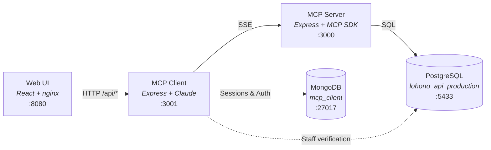
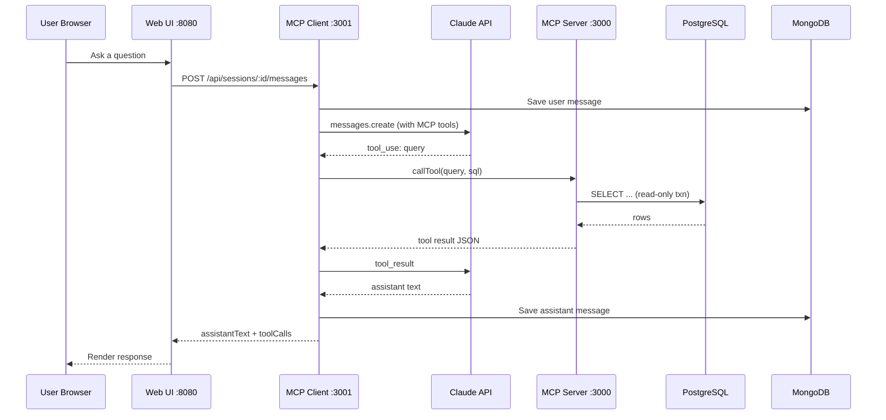
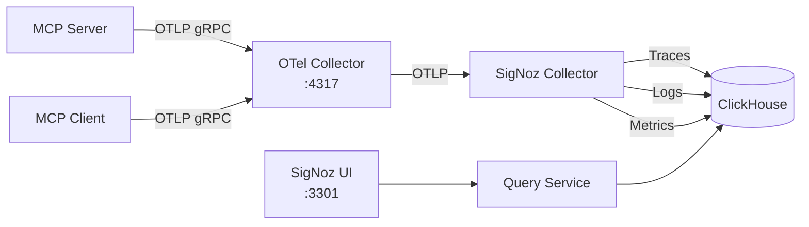

# Lohono AI — Database Context MCP Platform

An AI-powered data analyst for Lohono Stays. Users ask natural-language questions via a web UI, which are answered by Claude using MCP tools that query the production PostgreSQL database.

## Architecture



### Request Flow



### Observability Flow



**Services:**

- **Web Frontend** — React SPA served via nginx. Handles Google OAuth login and provides a chat interface.
- **MCP Client** — Express REST API. Manages sessions (MongoDB), authenticates users (Google OAuth + staff check in Postgres), and orchestrates Claude to answer questions using MCP tools.
- **MCP Server** — Express SSE server implementing the Model Context Protocol. Exposes database query tools, schema intelligence, Redash integration, and ACL enforcement.
- **PostgreSQL** — Lohono production database (`lohono_api_production`).
- **MongoDB** — Stores chat sessions, messages, and auth sessions.

## Prerequisites

- **Docker** and **Docker Compose** (v2)
- **Node.js 20+** and **npm** (for local development only)
- An **Anthropic API key** (Claude access)
- A PostgreSQL database dump (placed in `db/`)

## Getting Started

### 1. Clone and configure

```bash
git clone <repo-url>
cd lohono-db-context

# Create .env from the template
cp .env.example .env
```

Edit `.env` and fill in the **required** values (see [Environment Variables](#environment-variables) below).

### 2. Restore the database (first time only)

Place your SQL dump in the `db/` directory, then:

```bash
# Start just Postgres
make postgres

# Restore from dump
make db-restore DUMP=db/your_dump.sql.gz
```

### 3. Start everything

```bash
# All services in background (builds Docker images automatically)
make up-d
```

The web UI will be available at **http://localhost:8080**.

## Environment Variables

All configuration lives in `.env`. Copy from `.env.example` and fill in the required values:

| Variable | Required | Default | Description |
|----------|----------|---------|-------------|
| `DB_USER` | | `lohono_api` | PostgreSQL username |
| `DB_PASSWORD` | **Yes** | `lohono_api_password` | PostgreSQL password — **change in production** |
| `DB_NAME` | | `lohono_api_production` | PostgreSQL database name |
| `DB_EXTERNAL_PORT` | | `5433` | Host port to expose Postgres on |
| `MONGO_PORT` | | `27017` | Host port for MongoDB |
| `MONGODB_DB_NAME` | | `mcp_client` | MongoDB database name for sessions |
| `MCP_PORT` | | `3000` | Host port for the MCP SSE server |
| `ANTHROPIC_API_KEY` | **Yes** | — | Claude API key from Anthropic |
| `CLAUDE_MODEL` | | `claude-sonnet-4-5-20250929` | Claude model to use |
| `CLIENT_PORT` | | `3001` | Host port for the MCP client REST API |
| `WEB_PORT` | | `8080` | Host port for the web UI |
| `REDASH_URL` | | — | Redash instance URL (optional) |
| `REDASH_API_KEY` | | — | Redash API key (optional) |
| `MCP_USER_EMAIL` | | — | Fallback email for ACL in stdio mode |
| `OTEL_EXPORTER_OTLP_ENDPOINT` | | `http://otel-collector:4317` | OpenTelemetry Collector endpoint |
| `SIGNOZ_PORT` | | `3301` | Host port for SigNoz UI |
| `LOG_LEVEL` | | `info` | Log level: `debug`, `info`, `warn`, `error` |
| `NODE_ENV` | | `production` | Environment tag for traces |

## Running Services

### Run all services at once (Docker)

```bash
# Foreground (see all logs interleaved)
make up

# Background (detached)
make up-d

# Stop everything
make down
```

### Run individual services

Each command starts the service and its dependencies:

```bash
make postgres       # PostgreSQL only
make mongo          # MongoDB only
make mcp-server     # PostgreSQL + MCP Server
make mcp-client     # PostgreSQL + MongoDB + MCP Server + Client
make web            # All services including web frontend
```

### Local development (no Docker for app code)

Start databases in Docker, then run app services locally with hot-reload:

```bash
# Terminal 1 — databases
make postgres mongo

# Terminal 2 — MCP Server (port 3000)
make dev-server

# Terminal 3 — MCP Client API (port 3001)
make dev-client

# Terminal 4 — Web UI dev server (port 5173, proxied to 8080)
make dev-web
```

Or just run `make dev` to see these instructions.

**Install dependencies first** (one-time):

```bash
make dev-install
```

## Accessing Services

| Service | URL | Description |
|---------|-----|-------------|
| Web UI | http://localhost:8080 | Chat interface (login via Google OAuth) |
| MCP Client API | http://localhost:3001/api/health | REST API for sessions and chat |
| MCP Server | http://localhost:3000/health | MCP SSE server health check |
| MCP SSE Endpoint | http://localhost:3000/sse | SSE transport for MCP protocol |
| PostgreSQL | `localhost:5433` | Direct PG access (e.g. `psql -h localhost -p 5433 -U lohono_api -d lohono_api_production`) |
| MongoDB | `localhost:27017` | Direct Mongo access |
| SigNoz UI | http://localhost:3301 | Observability dashboard (if running) |

### Database shells

```bash
make db-shell       # psql shell into Postgres
make mongo-shell    # mongosh shell into MongoDB
```

## Deployment

### Quick production deployment

```bash
# 1. Configure environment
cp .env.example .env
# Edit .env — set ANTHROPIC_API_KEY, DB_PASSWORD, etc.

# 2. Deploy all services
make deploy
```

This builds all Docker images and starts everything in detached mode. Output shows the URLs for each service.

### Full deployment with observability (SigNoz + OpenTelemetry)

```bash
make deploy-all
```

This starts the observability stack (ClickHouse, SigNoz, OTel Collector) first, then the application services. All traces and structured logs from the MCP Server and Client are sent to SigNoz automatically.

### Deploy observability stack separately

```bash
make obs-up         # Start SigNoz + OTel Collector
make obs-down       # Stop observability stack
make obs-ps         # Check status
```

### Zero-downtime updates

To update a single service without downtime:

```bash
# Rebuild and restart just the MCP client
docker compose up -d --build --no-deps mcp-client

# Rebuild and restart just the MCP server
docker compose up -d --build --no-deps mcp-server

# Rebuild and restart just the web frontend
docker compose up -d --build --no-deps web
```

### Server prerequisites

On a fresh Ubuntu server:

```bash
# Install Docker
curl -fsSL https://get.docker.com | sh
sudo usermod -aG docker $USER

# Install Docker Compose plugin (if not included)
sudo apt-get install docker-compose-plugin

# Clone, configure, and deploy
git clone <repo-url>
cd lohono-db-context
cp .env.example .env
# Edit .env with production values
make deploy-all
```

### Database backups

```bash
make db-backup                          # Creates db/<timestamp>.sql.gz
make db-list                            # List available backups
make db-restore DUMP=db/20260207.sql.gz # Restore a specific backup
```

## Logs

### Docker container logs

```bash
make logs               # All services (interleaved, tailed)
make logs-mcp-server    # MCP Server only
make logs-mcp-client    # MCP Client only
make logs-web           # Web frontend (nginx)
make logs-postgres      # PostgreSQL
make logs-mongo         # MongoDB
```

### Observability stack logs

```bash
make obs-logs           # SigNoz + OTel Collector logs
```

### Structured log format

Application logs are structured JSON with the following fields:

```json
{
  "level": "info",
  "message": "HTTP 200 POST /api/sessions/abc/messages",
  "service": "lohono-mcp-client",
  "trace_id": "a1b2c3d4e5f6...",
  "span_id": "1a2b3c4d...",
  "timestamp_ist": "07/02/2026, 09:01:30.123",
  "user_id": "someone@isprava.com",
  "user_email": "someone@isprava.com",
  "http_method": "POST",
  "http_path": "/api/sessions/abc/messages",
  "http_status": 200,
  "duration_ms": 4523
}
```

Every log line includes `trace_id` and `span_id` for correlation with distributed traces in SigNoz.

### Viewing logs in SigNoz

If the observability stack is running (http://localhost:3301):

1. **Traces** tab — search by `traceID`, `user.email`, `serviceName`, or span attributes
2. **Logs** tab — filter by `trace_id`, `level`, `user_id`, service name
3. **Dashboards** — pre-built views for service health, error rates, latencies

## Debugging

### Check service health

```bash
# All containers status
make ps

# Health endpoints
curl http://localhost:3000/health       # MCP Server
curl http://localhost:3001/api/health   # MCP Client
curl http://localhost:8080/             # Web UI
```

### Trace a request end-to-end

Every API response includes an `X-Correlation-ID` header containing the trace ID. Use it to find the full request flow:

```bash
# Make a request and capture the trace ID
TRACE_ID=$(curl -s -D- http://localhost:3001/api/health | grep -i x-correlation-id | awk '{print $2}' | tr -d '\r')
echo "Trace ID: $TRACE_ID"
```

Then search for this trace ID in:
- **SigNoz** → Traces tab → paste the trace ID
- **Container logs** → `docker compose logs | grep $TRACE_ID`

### Common issues

**MCP Client can't connect to MCP Server:**
```bash
# Check if MCP Server is healthy
docker compose ps mcp-server
docker compose logs mcp-server --tail 50
```

**Authentication failures (403):**
The user's Google email must exist in the `staffs` table in Postgres and be marked `active = true`.
```bash
make db-shell
# Then: SELECT email, active FROM staffs WHERE email = 'user@example.com';
```

**Claude API errors:**
Check the `ANTHROPIC_API_KEY` is set correctly in `.env` and has sufficient quota.
```bash
docker compose logs mcp-client --tail 50 | grep -i error
```

**Database connection issues:**
```bash
# Verify Postgres is running and healthy
docker compose ps postgres
docker compose exec postgres pg_isready -U lohono_api
```

**Observability not receiving data:**
```bash
# Check OTel Collector health
curl http://localhost:13133
make obs-logs
```

### Increase log verbosity

Set these in `.env` and restart:

```bash
LOG_LEVEL=debug                  # Application debug logs
OTEL_LOG_LEVEL=debug             # OpenTelemetry SDK debug logs
```

Then restart:
```bash
docker compose up -d --build mcp-server mcp-client
```

### Database query debugging

Use the MCP Server's `/health` endpoint to verify DB connectivity, then check query logs:

```bash
# Watch all MCP Server logs for SQL queries
docker compose logs -f mcp-server | grep -i "query\|sql\|error"
```

In SigNoz, search for spans with `db.system = "postgresql"` to see query timing and errors.

## Project Structure

```
├── src/
│   ├── index-sse.ts            # MCP Server entrypoint (SSE transport)
│   ├── index.ts                # MCP Server entrypoint (stdio transport)
│   ├── tools.ts                # MCP tool definitions and handlers
│   ├── acl.ts                  # Access control enforcement
│   ├── schema-rules.ts         # Sales funnel business rules
│   ├── query-analyzer.ts       # SQL query structural analysis
│   ├── rule-generator.ts       # YAML rule generation from SQL
│   ├── redash-client.ts        # Redash API integration
│   ├── client/
│   │   ├── index.ts            # MCP Client entrypoint
│   │   ├── server.ts           # Express REST API routes
│   │   ├── agent.ts            # Claude agentic loop
│   │   ├── mcp-bridge.ts       # MCP SSE client bridge
│   │   ├── db.ts               # MongoDB session/message storage
│   │   └── auth.ts             # Google OAuth + staff verification
│   └── observability/
│       ├── tracing.ts          # OpenTelemetry SDK bootstrap
│       ├── logger.ts           # Structured JSON logger (Winston)
│       ├── middleware.ts       # Express request/response logging
│       ├── spans.ts            # Custom span helpers (MCP, DB, Claude)
│       ├── sanitize.ts         # PII masking and data sanitization
│       └── index.ts            # Barrel export
├── lohono-chat-client/                        # React frontend (Vite + Tailwind)
├── config/                     # ACL and business rule YAML configs
├── signoz/                     # SigNoz internal configs
├── db/                         # Database backups
├── docs/
│   └── observability-queries.md  # SigNoz/ClickHouse query examples
├── docker-compose.yml          # Application stack
├── docker-compose.observability.yml  # SigNoz + OTel Collector stack
├── otel-collector-config.yaml  # OTel Collector pipeline config
├── Dockerfile                  # MCP Server image
├── Dockerfile.client           # MCP Client image
├── Dockerfile.chat-client              # Web frontend image
├── nginx.conf                  # nginx config for web SPA
├── Makefile                    # All operational commands
└── .env.example                # Environment variable template
```

## Makefile Reference

Run `make help` to see all available commands:

```
  help                 Show this help
  env                  Create .env from .env.example
  up                   Start all services in foreground
  up-d                 Start all services in background
  down                 Stop and remove all containers
  restart              Restart all services
  build                Build all Docker images (no cache)
  ps                   Show running containers
  postgres             Start only PostgreSQL
  mongo                Start only MongoDB
  mcp-server           Start PostgreSQL + MCP server
  mcp-client           Start databases + MCP server + client
  web                  Start everything including web frontend
  logs                 Tail logs from all services
  logs-postgres        Tail PostgreSQL logs
  logs-mongo           Tail MongoDB logs
  logs-mcp-server      Tail MCP server logs
  logs-mcp-client      Tail MCP client logs
  logs-web             Tail web frontend logs
  db-backup            Dump PostgreSQL to db/<timestamp>.sql.gz
  db-restore           Restore PostgreSQL from DUMP=db/<file>.sql.gz
  db-list              List available database backups
  db-shell             Open a psql shell
  mongo-shell          Open a mongosh shell
  dev-install          Install all npm dependencies
  dev-server           Run MCP SSE server locally
  dev-client           Run MCP client API locally
  dev-web              Run web frontend dev server
  dev                  Print local dev instructions
  deploy               Build and start all services (production)
  deploy-all           Deploy app + observability (1-click)
  obs-up               Start observability stack
  obs-down             Stop observability stack
  obs-logs             Tail observability stack logs
  obs-ps               Show observability stack status
  obs-clean            Stop observability stack and remove volumes
  clean                Stop containers and remove images + volumes
  clean-all            Stop everything and remove all volumes
  prune                Remove dangling Docker resources
```

## Scaffold Prompt

Use the following prompt with an AI coding assistant to recreate this project's core client-server infrastructure from scratch:

---

**Build a full-stack chat application with the following architecture:**

**Tech Stack:**
- **Client:** React + TypeScript + Vite + Tailwind CSS
- **Server:** Node.js + Express + TypeScript
- **Database:** MongoDB (via Mongoose) for storing users, sessions, and messages
- **Caching:** MongoDB TTL collections for session caching (or Redis-like pattern using MongoDB)
- **Auth:** Google OAuth with JWT tokens stored in localStorage
- **Observability:** OpenTelemetry SDK + OTel Collector + SigNoz (ClickHouse-backed) for distributed tracing, structured logging, and metrics

**Project Structure:**
```
project/
├── client/          # React SPA
│   └── src/
│       ├── api.ts              # API client with global 401 handler
│       ├── context/AuthContext  # Auth state + token persistence
│       ├── components/          # Sidebar, ChatView
│       └── pages/               # AuthCallbackPage
├── server/          # Express API
│   └── src/
│       ├── routes/auth.ts       # Google OAuth + JWT
│       ├── routes/sessions.ts   # CRUD for chat sessions
│       ├── routes/messages.ts   # Send/receive messages
│       ├── middleware/auth.ts   # JWT verification middleware
│       ├── models/              # Mongoose schemas
│       ├── cache.ts             # MongoDB-based cache layer
│       └── observability/
│           ├── tracing.ts       # OpenTelemetry SDK bootstrap
│           ├── logger.ts        # Structured JSON logger (Winston)
│           ├── middleware.ts     # Express request/response logging
│           ├── spans.ts         # Custom span helpers
│           └── sanitize.ts      # PII masking and data sanitization
├── docker-compose.yml                  # Application stack
├── docker-compose.observability.yml    # SigNoz + OTel Collector stack
├── otel-collector-config.yaml          # OTel Collector pipeline config
├── Dockerfile
└── package.json     # Monorepo root
```

**Requirements:**

1. **Auth Flow:** User clicks login -> redirects to Google OAuth -> callback receives token -> stored in localStorage. On refresh, restore session from localStorage without redirecting to login. Add a global 401 handler in the API client that clears the session and redirects to login only on user-initiated API calls.

2. **Chat Sessions:** Users can create, list, select, and delete chat sessions. Each session has a title, timestamps, and a list of messages. Sidebar shows session history.

3. **API Client:** A typed `request()` wrapper around fetch that auto-attaches the Bearer token, handles JSON parsing, and has a `skipAuthRedirect` option for background calls like token verification.

4. **MongoDB Models:**
   - `User` -- userId, email, name, picture
   - `Session` -- sessionId, userId, title, createdAt, updatedAt
   - `Message` -- sessionId, role (user/assistant), content, createdAt
   - `Cache` -- key, value, expiresAt (with TTL index)

5. **Docker:** Multi-stage Dockerfile that builds both client and server. docker-compose with app + MongoDB services. Separate docker-compose.observability.yml for the observability stack.

6. **Dev Setup:** Vite dev server proxies `/api` to the Express backend. Single `npm run dev` starts both.

7. **Observability:** Instrument the server with OpenTelemetry for distributed tracing and structured logging.
   - Bootstrap the OTel SDK at startup (`tracing.ts`) — register a `NodeTracerProvider` with an OTLP gRPC exporter pointing at the OTel Collector.
   - Add Express middleware that creates a span per request, attaching `http.method`, `http.route`, `http.status_code`, `user.email`, and a `X-Correlation-ID` response header with the trace ID.
   - Use Winston for structured JSON logging. Every log line must include `trace_id`, `span_id`, `timestamp_ist`, `service`, and `level` fields so logs can be correlated with traces in SigNoz.
   - Create custom span helpers for wrapping DB queries, external API calls, and AI model calls with timing and error attributes.
   - Add a `sanitize.ts` module that masks PII (emails, tokens) in log output.
   - Configure an OTel Collector (`otel-collector-config.yaml`) with an OTLP gRPC receiver on port 4317, batch processor, and OTLP exporter forwarding to SigNoz.
   - Add a `docker-compose.observability.yml` that runs ClickHouse, SigNoz Query Service, SigNoz Frontend (UI on port 3301), and the OTel Collector. The application services send telemetry to the collector via `OTEL_EXPORTER_OTLP_ENDPOINT`.
