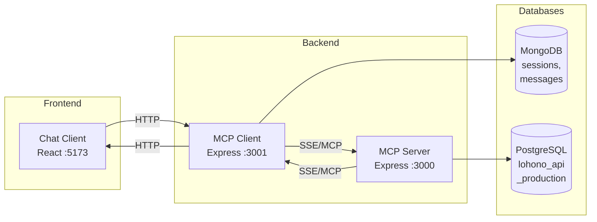
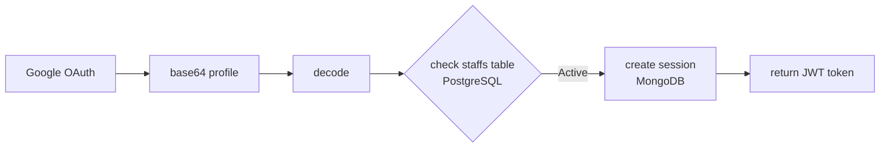
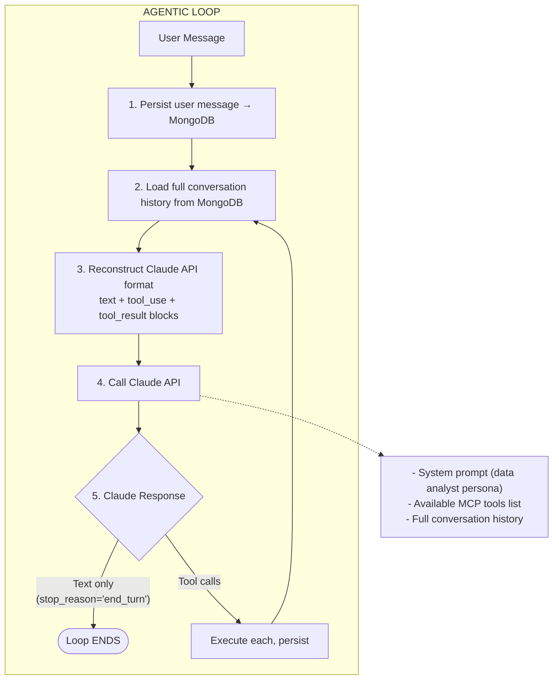
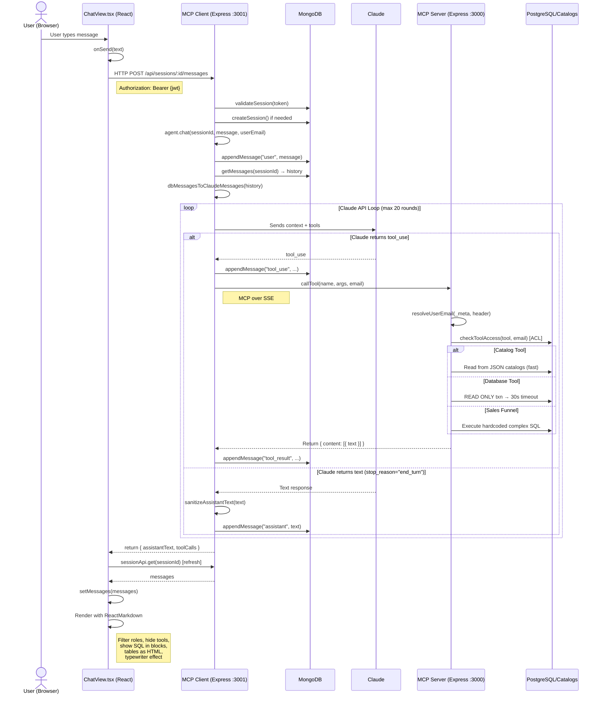

# NLP-to-SQL Pipeline: End-to-End Architecture

This document describes the complete flow of how a natural language query from the chat client gets processed into a SQL query and results are returned to the user.

## Architecture Overview

The system has **3 main components**:

| Component | Port | Tech | Role |
|-----------|------|------|------|
| **lohono-chat-client** | 5173 | React + Vite | Chat UI |
| **lohono-mcp-client** | 3001 | Express + MongoDB | Orchestration layer (Claude agent) |
| **lohono-mcp-server** | 3000 | Express + SSE | MCP tools + PostgreSQL access |



---

## Step-by-Step Pipeline

### Step 1: User Sends a Message (Chat Client)

**Files:** `lohono-chat-client/src/components/ChatView.tsx`, `lohono-chat-client/src/api.ts`

1. User types a natural language query (e.g. "How many leads did we get in January 2025?") in the React chat UI
2. `ChatInput.onSend()` fires and calls `sessionsApi.sendMessage(sessionId, message)`
3. This makes an HTTP request: `POST /api/sessions/:id/messages` with the Authorization header containing a Bearer JWT token

### Step 2: Authentication & Session Validation (MCP Client)

**Files:** `lohono-mcp-client/src/server.ts`, `lohono-mcp-client/src/auth.ts`

1. Express middleware validates the JWT token against MongoDB `auth_sessions` collection
2. Session ownership is verified (user must own the session)
3. The request is routed to `chat(sessionId, message, userEmail)` in `agent.ts`

**Authentication flow (initial login):**


### Step 3: Claude Agent Loop (MCP Client - Core Orchestration)

**File:** `lohono-mcp-client/src/agent.ts`

This is the heart of the system. It runs an **agentic loop** (max 20 rounds) where Claude autonomously decides how to answer the query.



**System prompt context** tells Claude:
- It is an expert data analyst for Lohono Stays
- It has access to database tools via MCP
- For sales funnel metrics → always use `get_sales_funnel` tool
- Present results in clear, professional format
- Show SQL queries in markdown code blocks for transparency

**Key helper functions:**
- `dbMessagesToClaudeMessages()` — reconstructs multi-turn conversation from MongoDB records, converting `tool_use` and `tool_result` DB entries back into Claude API format
- `sanitizeAssistantText()` — strips XML markup (`<function_calls>`, `<invoke>`, `<parameter>` tags) from Claude's response before showing to the user

### Step 4: Tool Execution via MCP Bridge

**File:** `lohono-mcp-client/src/mcp-bridge.ts`

When Claude decides to call a tool (e.g. `get_sales_funnel`, `get_table_schema`):

1. MCP client connects to the MCP server over **SSE (Server-Sent Events)**
2. Calls `mcpClient.callTool({ name, arguments, _meta: { user_email } })`
3. MCP server returns result as `{ content: [{ type: "text", text: "..." }] }`
4. Tool list is cached per user with a 5-minute TTL

### Step 5: MCP Server Receives Tool Call

**File:** `lohono-mcp-server/src/index-sse.ts`

1. User email resolved from `_meta` or SSE headers
2. **ACL check** — verifies user has permission for the requested tool
3. Request routed to `handleToolCall(name, args, userEmail)` in `tools.ts`

### Step 6: Access Control (ACL)

**File:** `lohono-mcp-server/src/acl.ts`, **Config:** `config/acl.yml`

```mermaid
graph TD
    Request[Tool call request] --> Email[Resolve user email]
    Email --> ACLs[Fetch user ACLs from staffs table<br>PostgreSQL, cached 5 min]
    ACLs --> Load[Load ACL config<br>acl.yml]
    Load --> Super{is user a superuser?}
    
    Super -- Yes --> Allow([Allow all])
    Super -- No --> Public{is tool in public_tools?}
    
    Public -- Yes --> Allow
    Public -- No --> Disabled{is tool in disabled_tools?}
    
    Disabled -- Yes --> Deny([Deny])
    Disabled -- No --> Overlap{do user's ACLs overlap<br>with tool's required ACLs?}
    
    Overlap --> AllowDeny([Allow / Deny])
    
    Allow --> Return[Return: { allowed, reason }]
    Deny --> Return
    AllowDeny --> Return
```

ACL config structure:
```yaml
default_policy: open
superuser_acls: [...]
public_tools: [list_tables, get_tables_summary, ...]
disabled_tools: [...]
tool_acls:
  get_sales_funnel: [sales_admin, executive]
  analyze_query: [data_engineer, admin]
```

### Step 7: Tool Execution & Database Queries

**File:** `lohono-mcp-server/src/tools.ts` (24 tools available)

Tools fall into these categories:

#### Schema Exploration Tools (read from pre-built JSON catalogs — no DB hit)
| Tool | Purpose |
|------|---------|
| `get_tables_summary` | All tables with column counts, sorted by size |
| `get_table_schema` | Full column definitions for a table |
| `search_tables` | Case-insensitive substring match on table names |
| `get_table_relationships` | Foreign keys (incoming + outgoing) for a table |
| `get_schema_context` | Multi-table definitions + FK relationships |
| `find_tables_by_column` | Discover which tables contain a column name |
| `get_relationship_chain` | BFS graph traversal of related tables |
| `get_catalog_metadata` | Verify catalog file availability |

These tools read from pre-generated files:
- `database/schema/database-catalog.json` — all table definitions
- `database/schema/foreign-keys-catalog.json` — all FK relationships with business context

#### Live Database Query Tools
| Tool | Purpose |
|------|---------|
| `list_tables` | List tables in a schema |
| `describe_table` | Get column definitions (live query) |
| `list_schemas` | List all schemas |

All wrapped in **READ ONLY transactions** with 30-second timeouts:
```typescript
await client.query("BEGIN TRANSACTION READ ONLY")
await client.query("SET LOCAL statement_timeout = '30s'")
const result = await client.query(sql, params)
await client.query("COMMIT")
```

#### Business Logic Tool
| Tool | Purpose |
|------|---------|
| `get_sales_funnel` | Hardcoded complex SQL for Leads/Prospects/Accounts/Sales |

This tool exists because the sales funnel SQL is too complex for Claude to reliably generate. It handles:
- IST timezone conversion (+330 minutes)
- UNION of 4 source tables (`development_opportunities`, `enquiries`, `stage_histories`, `tasks`)
- Exclusion filters (slug, source != 'DnB')
- Window functions and `MIN() + GROUP BY HAVING` for first-time stage entry
- Distinct counting across multiple dimensions

#### Query Analysis Tools
| Tool | Purpose |
|------|---------|
| `analyze_query` | Extract SQL patterns (tables, joins, CTEs, aggregations) |
| `generate_rules` | SQL to YAML rules + MCP tool definition |
| `fetch_redash_query` | Fetch SQL from Redash by query ID |
| `generate_rules_from_redash` | Redash query to YAML rules pipeline |

### Step 8: SQL Generation

**There is no separate NLP-to-SQL module.** Claude itself generates SQL by:

1. Calling schema tools (`get_table_schema`, `get_table_relationships`, etc.) to understand the database structure
2. Using its training knowledge + the system prompt context to write correct SQL
3. For sales funnel metrics, it uses the `get_sales_funnel` tool instead of writing custom SQL
4. The time range parser (`lohono-mcp-server/src/time-range/parser.ts`) can help resolve natural language time expressions:

```
"MTD"           → first of current month to today
"last quarter"  → previous quarter start/end dates
"YTD"           → January 1 to today
"last 30 days"  → 30 days ago to today
"between X and Y" → explicit date range
```

### Step 9: Results Flow Back to the User

```mermaid
graph TD
    PG[PostgreSQL query result] --> Tools[tools.ts: Format as JSON string]
    Tools --> MCP[MCP content block: { type: 'text', text: '...' }]
    MCP --> Bridge[mcp-bridge.ts: Extract text from content blocks]
    Bridge --> Persist[agent.ts: Persist as 'tool_result' in MongoDB]
    Persist --> Claude[Claude receives result,<br>reasons over it, may call more tools<br>or produce final answer]
    Claude --> Sanitize[agent.ts: Sanitize XML markup from Claude's response]
    Sanitize --> Server[server.ts: Return { assistantText, toolCalls }<br>as HTTP response]
    Server --> ChatView[ChatView.tsx: Render with ReactMarkdown<br>(tables, code blocks, typewriter effect)]
```

- `tool_use` and `tool_result` messages are **hidden** from the user
- Only `user` and `assistant` messages are displayed
- SQL queries are shown in markdown code blocks for transparency

---

## Complete Data Flow Diagram



---

## Persistence Layer

**Database:** MongoDB (`mcp_client` database)

### Sessions Collection
```typescript
{
  sessionId: string,    // UUID
  userId: string,       // user email
  title: string,        // auto-generated from first message
  createdAt: Date,
  updatedAt: Date
}
```

### Messages Collection
```typescript
{
  sessionId: string,
  role: "user" | "assistant" | "tool_use" | "tool_result",
  content: string,
  toolName?: string,        // for tool_use
  toolInput?: Record,       // for tool_use (arguments passed)
  toolUseId?: string,       // for tool_use and tool_result (links them)
  createdAt: Date
}
```

Every step is persisted, enabling:
- Full conversation replay across sessions
- Multi-turn context for Claude (reconstructed on each API call)
- Audit trail of all tool calls and results

---

## Database Catalog Layer

**File:** `lohono-mcp-server/src/database-catalog.ts`

Pre-generated catalog files provide fast schema lookups without hitting the live database:

### database-catalog.json
```json
[
  {
    "schema": "public",
    "name": "development_opportunities",
    "type": "TABLE",
    "columns": [
      {
        "column_name": "id",
        "data_type": "uuid",
        "is_nullable": "NO",
        "column_default": "gen_random_uuid()"
      }
    ]
  }
]
```

### foreign-keys-catalog.json
```json
{
  "metadata": { "database": "lohono_api_production", "version": "1.0" },
  "foreign_keys": [
    {
      "table": "development_opportunities",
      "column": "id",
      "references_table": "stage_histories",
      "references_column": "leadable_id",
      "relationship_type": "has_many",
      "cardinality": "1:N",
      "business_context": "Tracks stage progression of leads",
      "join_example": "development_opportunities.id = stage_histories.leadable_id",
      "polymorphic": true,
      "polymorphic_type_column": "leadable_type",
      "polymorphic_type_value": "Development::Opportunity"
    }
  ]
}
```

---

## Key Design Decisions

1. **Claude IS the NLP engine** — there is no separate intent classifier or NLP-to-SQL translator. Claude autonomously decides what to query and how, using tools to explore the schema and execute queries.

2. **Read-only database access** — all queries run inside `BEGIN TRANSACTION READ ONLY` with a 30-second timeout, preventing accidental data modification.

3. **Pre-built schema catalog** — schema and FK relationship lookups read from JSON files loaded at startup, avoiding repeated database hits for metadata queries.

4. **ACL at the tool level** — each tool call is validated against the user's `acl_array` from the `staffs` table, with results cached for 5 minutes.

5. **Sales funnel as a dedicated tool** — the funnel SQL (Leads, Prospects, Accounts, Sales) is too complex for Claude to reliably generate, so it's hardcoded in `get_sales_funnel` with correct IST timezone handling, multi-source UNIONs, and window functions.

6. **Message reconstruction** — full conversation history is rebuilt from MongoDB on each Claude API call, converting DB records back to Claude's expected format (including tool_use/tool_result blocks).

7. **Text sanitization** — XML markup and internal tool mechanics are stripped from Claude's responses before they reach the user, keeping the interface clean and focused on business insights.

8. **Observability** — OpenTelemetry traces are emitted for each Claude call and tool execution, exported to SigNoz via OTLP/gRPC for monitoring and debugging.

---

## Key Files Reference

| File | Purpose |
|------|---------|
| `lohono-chat-client/src/api.ts` | HTTP client for REST endpoints |
| `lohono-chat-client/src/components/ChatView.tsx` | React chat UI component |
| `lohono-mcp-client/src/server.ts` | Express REST API server |
| `lohono-mcp-client/src/agent.ts` | Claude orchestration loop |
| `lohono-mcp-client/src/mcp-bridge.ts` | MCP client (SSE) connection to MCP server |
| `lohono-mcp-client/src/db.ts` | MongoDB session/message persistence |
| `lohono-mcp-client/src/auth.ts` | Google OAuth + staff verification |
| `lohono-mcp-server/src/index-sse.ts` | MCP SSE server entry point |
| `lohono-mcp-server/src/tools.ts` | 24 tool definitions + handlers |
| `lohono-mcp-server/src/database-catalog.ts` | Schema catalog loader |
| `lohono-mcp-server/src/query-analyzer.ts` | SQL pattern extraction |
| `lohono-mcp-server/src/acl.ts` | Access control enforcement |
| `lohono-mcp-server/src/time-range/parser.ts` | Natural language time expression parsing |
| `lohono-mcp-server/src/nlq-resolver/parser.ts` | NLQ intent detection |
| `config/acl.yml` | ACL configuration |
| `database/schema/database-catalog.json` | Pre-built table definitions |
| `database/schema/foreign-keys-catalog.json` | Pre-built FK relationships |
